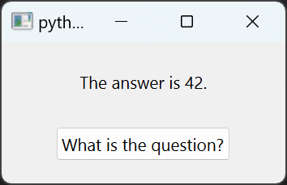

Async "Minimal" Example
=======================

The Python language provides keywords for asynchronous operations, i.e.,
"async" to define coroutines or "await" to schedule asynchronous calls in the
event loop (see `PEP 492 <https://peps.python.org/pep-0492/>`_). It is up to
packages to implement an event loop, support for these keywords, and more.

The best-known package for this is `asyncio`. asyncio offers an API that allows
for the asyncio event loop to be replaced by a custom implementation. Such an
implementation is available with the `QtAsyncio` module. It is based on Qt and
uses Qt's event loop in the backend.

`trio` is another popular package that offers a dedicated `low-level API
<https://trio.readthedocs.io/en/stable/reference-lowlevel.html>`_ for more
complex use cases. Specifically, there exists a function `start_guest_run` that
enables running the Trio event loop as a "guest" inside another event loop -
Qt's in our case, standing in contrast to asyncio's approach.

Based on this functionality, two examples for async usage with Qt have been
implemented: `eratosthenes` and `minimal`:

* `eratosthenes` is a more extensive example that visualizes the Sieve of
  Eratosthenes algorithm. This algorithm per se is not one that is particularly
  suitable for asynchronous operations as it's not I/O-heavy, but synchronizing
  coroutines to a configurable tick allows for a good visualization.
* `minimal` is a minimal example featuring a button that triggers an
  asynchronous coroutine with a sleep. It is designed to highlight which
  boilerplate code is essential for an async program with Qt and offers a
  starting point for more complex programs.

While `eratosthenes` offloads the asynchronous logic that will run in
trio's/asyncio's event loop into a separate class, `minimal` demonstrates that
async functions can be integrated into any class, including subclasses of Qt
classes.
