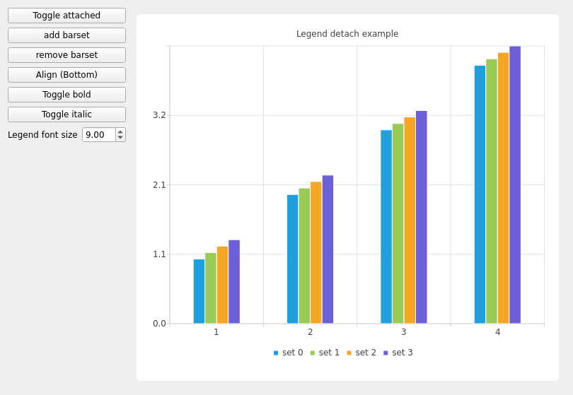

Legend Example
==============

This example shows how to detach the legend from the chart and how to attach it
back.

By default the chart draws the legend inside the same view with the chart. In
some cases the user may want to draw the legend to somewhere else. To make this
possible the legend can be detached from the chart. Detaching means that the
chart doesn't draw the legend or try to change its layout. The detached legend can
then be drawn wherever the user wishes, for example, in a different graphics
scene. The behavior of the legend can be inspected by running the legend
example. In the example we use the bar series where we add or remove the bar
sets. The legend reflects the changes in the series. The legend can be detached or
attached back to the chart and its alignment can be modified. When the legend
is detached, it can be resized and positioned freely.

