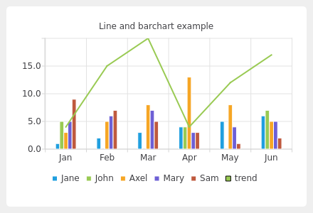

Line and Bar Chart Example
==========================

The example shows how to combine different charts and set the axes.

In the example, we combine a linechart with a barchart and use the category
axis as a common axis for both.

