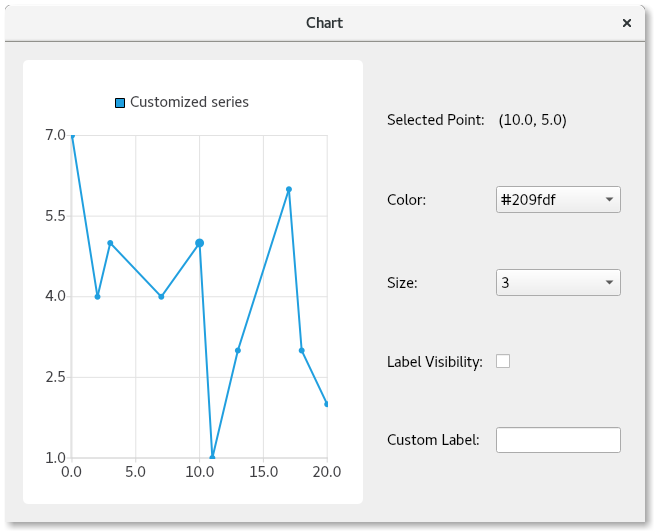

.. role:: py(code)
   :language: python

Selected Point Configuration Example
====================================

This example shows how to configure individual points of a :py:`QLineSeries`.

Features demonstrated
~~~~~~~~~~~~~~~~~~~~~

In this application you will learn how to:

* Select a series of points on click
* Override the configuration for the following properties of specific points:

  * Color
  * Size
  * Label visibility
  * Text format of the label

Subclass QMainWindow
~~~~~~~~~~~~~~~~~~~~

Create a subclass of :py:`QMainWindow` to contain the chart and controls.

.. literalinclude:: chartwindow.py
   :linenos:
   :lineno-start: 16
   :lines: 16-18

Create a line series
~~~~~~~~~~~~~~~~~~~~

Create a :py:`QLineSeries` containing the points to plot. Give it a name and make the points
visible.

.. literalinclude:: chartwindow.py
   :linenos:
   :lineno-start: 20
   :lines: 20-28

Create the point configuration controls
~~~~~~~~~~~~~~~~~~~~~~~~~~~~~~~~~~~~~~~

Now, create controls to configure the color, size, and label visibility attributes of a point.

#. Create an associated label for each control, so the user knows what the control does.
#. For the color and size, use a :py:`QComboBox`, populating it with a variety of colors and size
   choices.
#. Create the final two controls. Create a :py:`QCheckbox` to control the visibility of the selected
   point, and a :py:`QLineEdit` to allow the user to provide a custom label for it.

.. note::
   Do not set initial values for any of the controls, as a point will always be selected showing
   its current settings.

.. literalinclude:: chartwindow.py
   :linenos:
   :lineno-start: 31
   :lines: 31-52

Populate the controls upon selecting a point
~~~~~~~~~~~~~~~~~~~~~~~~~~~~~~~~~~~~~~~~~~~~

Add the logic to set the current control values depending on the chosen point. Note that the whole
series value is used if there is no customization for a selected point. In this case, if the series
is set to show blue points, a blue color value will be shown in the color combobox.

Perform some actions upon clicking on the lineseries. Look up the point clicked on and remove the
prior point selection. Finally, select the point that was clicked on. This makes the point larger to
indicate its selection. The current selected point's index and :py:`PointConfigurations` are saved
to a member variable for later use.

Query the :py:`PointConfigurations`, and use those to find the matching indices in the combo boxes.
Set the current indices of the comboboxes to the corresponding values you looked up. Similarly,
look up the values in :py:`PointConfigurations`, and update the checkbox and line edit controls.

.. literalinclude:: chartwindow.py
   :linenos:
   :lineno-start: 54
   :lines: 54
.. literalinclude:: chartwindow.py
   :linenos:
   :lineno-start: 97
   :lines: 97-132

Provide the logic to configure the selected point
~~~~~~~~~~~~~~~~~~~~~~~~~~~~~~~~~~~~~~~~~~~~~~~~~

Now that the controls are populated with some values, add logic to do something when the value
changes. Connect the control signals and the logic, to configure the selected point based on the
chosen values in the controls. You can do this by setting the :py:`QXYSeries::PointConfiguration`
value that is associated with the control, to the :py:`m_selectedPointConfig` and
:py:`PointConfigurations` member variables, and call :py:`QXYSeries::setPointConfiguration`.

.. literalinclude:: chartwindow.py
   :linenos:
   :lineno-start: 55
   :lines: 55-60
.. literalinclude:: chartwindow.py
   :linenos:
   :lineno-start: 140
   :lines: 140-156

Create the chart and lay out the controls
~~~~~~~~~~~~~~~~~~~~~~~~~~~~~~~~~~~~~~~~~

Finally, create the chart and its view, add the series to the chart, create the layout of the
window, and select an initial point.

.. literalinclude:: chartwindow.py
   :linenos:
   :lineno-start: 62
   :lines: 62-95

In our entrypoint file `pointconfiguration.py`, instantiate the :py:`ChartWindow`, resize it, show
it, and start the event loop.

.. literalinclude:: pointconfiguration.py
   :linenos:
   :lineno-start: 11
   :lines: 11-17

You now have a fully functioning application that demonstrates how to customize individual chart
points.

Usage
-----
To use this example, click any point you'd like to customize, change any of the comboboxes and
checkboxes controlling the individual point color, size, label visibility. You can customize the
label text in the line edit at the bottom.

There are three special formatting strings for the label that you can use: ``@pointX``, ``@pointY``,
and ``@index``. These are replaced with the x value, y value, and index of the point, respectively.
More information about that can be found in the documentation for
`QtCharts.QXYSeries.pointLabelsFormat`_.

.. _`QtCharts.QXYSeries.pointLabelsFormat`: https://doc.qt.io/qt-6/qxyseries.html#pointLabelsFormat-prop
