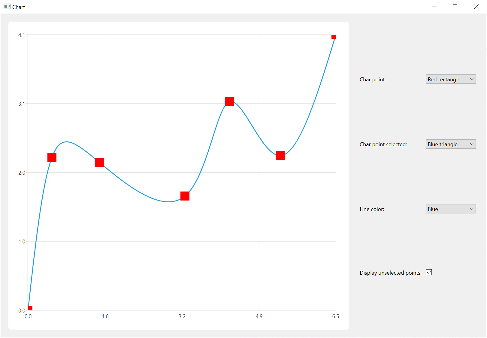

.. role:: py(code)
   :language: python

Light Markers and Points Selection Example
==========================================

The Light Markers and Points Selection example shows how to use light markers
and point selections in a series.

Creating the chart and its elements
~~~~~~~~~~~~~~~~~~~~~~~~~~~~~~~~~~~~

We start by creating a series, filling it with the data, and enabling the light marker and point selection features.
It is important not to set points visibility to :py:`True`, because light markers functionality is an independent feature and setting both would result in undesired behavior.

.. literalinclude:: pointselectionandmarkers.py
   :linenos:
   :lineno-start: 20
   :lines: 20-42
   :emphasize-lines: 2-12

Then we create the :py:`QChart`, the :py:`QChartview` and the control widget with its layout to arrange customization elements.

.. literalinclude:: pointselectionandmarkers.py
   :lineno-start: 44
   :lines: 44-53
   :emphasize-lines: 1,6,9

Creating UI for configuring the chart
~~~~~~~~~~~~~~~~~~~~~~~~~~~~~~~~~~~~~

The next step is where we create user interface elements that allow customizing the chart, including setting light marker and selection marker images.

.. literalinclude:: pointselectionandmarkers.py
   :linenos:
   :lineno-start: 54
   :lines: 54-57

We create the label for the marker selection combobox and fill the combobox with the items. We then provide functionality to the combobox, allowing the user's selection to set the desired light marker image. As light markers are enabled and disabled by setting a valid QImage or setting an empty :py:`QImage()`, we need to make sure that if the user does not wish unselected points to be displayed, we do not actually set the light marker image.
If checking isn't performed, a new :py:`QImage` will be set as the light marker and unselected points will be visible even though it has been switched off.

.. literalinclude:: pointselectionandmarkers.py
   :linenos:
   :lineno-start: 59
   :lines: 59-67
   :emphasize-lines: 1-3

Almost the same procedure applies to the selected point light marker and line color. The only difference is that there is no need to check the visibility of unselected points as it doesn't affect the functionality.

.. literalinclude:: pointselectionandmarkers.py
   :linenos:
   :lineno-start: 70
   :lines: 70-85

A small difference comes with changing visibility of unselected points. As it was mentioned before, making light markers invisible is achieved by setting the light marker to an empty :py:`QImage()`. That is why, depending on checkbox state, selected point light marker is set to an empty :py:`QImage` or to the light marker extracted from the current index of the corresponding combobox.

.. literalinclude:: pointselectionandmarkers.py
   :linenos:
   :lineno-start: 88
   :lines: 88-97
   :emphasize-lines: 5-6

The final part is to lay out the widgets within the main widget and set the main window size.

Usage
-----
To use this example, change any of the comboboxes and checkboxes controlling the markers, line color, and unselected point visibility on the right. Then try clicking on points in the chart to select or deselect them.
