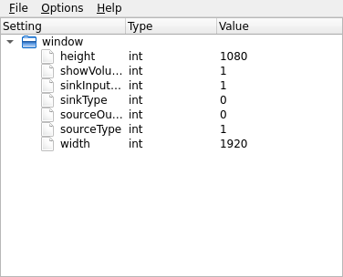

Settings Editor Example
=======================

The Settings Editor example shows how Qt's standard settings support is used in
an application by providing an editor that enables the user to view the
settings for installed applications, and modify those that can be edited.

