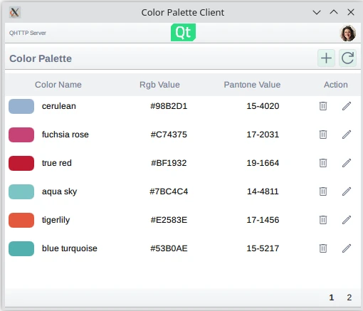

RESTful API client
==================

Example of how to create a RESTful API QML client.

This example shows how to create a basic QML RESTful API client with an
imaginary color palette service. The application uses RESTful communication
with the selected server to request and send data. The REST service is provided
as a QML element whose child elements wrap the individual JSON data APIs
provided by the server.

Application functionality
-------------------------

The example provides the following basic functionalities:
* Select the server to communicate with
* List users and colors
* Login and logout users
* Modify and create new colors

Server selection
----------------

At start the application presents the options for the color palette server to communicate
with. The predefined options are:

* ``https://reqres.in``, a publicly available REST API test service
* A Qt-based REST API server example in ``QtHttpServer``

Once selected, the RESTful API client issues a test HTTP GET to the color API
to check if the service is accessible.

One major difference between the two predefined API options is that the
Qt-based REST API server example is a stateful application which allows
modifying colors, whereas the ``reqres.in`` is a stateless API testing service.
In other words, when using the ``reqres.in`` backend, modifying the colors has
no lasting impact.

The users and colors are paginated resources on the server-side. This means
that the server provides the data in chunks called pages. The UI listing
reflects this pagination and views the data on pages.

Viewing the data on UI is done with standard QML views where the model are
QAbstractListModel-derived classes representing JSON data received from the
server.

Logging in happens via the login function provided by the login popup. Under
the hood the login sends a HTTP POST request. Upon receiving a successful
response the authorization token is extracted from the response, which in turn
is then used in subsequent HTTP requests which require the token.

Editing and adding new colors is done in a popup. Note that uploading the color
changes to the server requires that a user has logged in.

REST implementation
-------------------

The example illustrates one way to compose a REST service from individual resource elements. In
this example the resources are the paginated user and color resources plus the login service.
The resource elements are bound together by the base URL (server URL) and the shared network access
manager.

The basis of the REST service is the RestService QML element whose children items
compose the actual service.

Upon instantiation the RestService element loops its children elements and sets
them up to use the same network access manager. This way the individual
resources share the same access details such as the server URL and
authorization token.

The actual communication is done with a rest access manager which implements
some convenience functionality to deal specifically with HTTP REST APIs and
effectively deals with sending and receiving the ``QNetworkRequest`` and
``QNetworkReply`` as needed.

