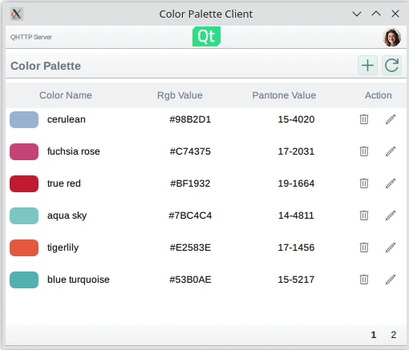

RESTful API client
==================

Example of how to create a RESTful API QML client.

This example shows how to create a basic QML RESTful API client with an
imaginary color palette service. The application uses RESTful communication
with a local server to request and send data. The REST service is provided
as a QML element whose child elements wrap the individual JSON data APIs
provided by the server.

Application functionality
-------------------------

The example provides the following basic functionalities:

* List users and colors
* Login and logout users
* Modify and create new colors

Running a server
----------------

The client talks to a local REST server on ``http://127.0.0.1:49425``. Start
one of the following before launching the client:

* A **FastAPI-based REST API server** bundled under ``server/`` — the
  easiest option to get started.
* A `Qt-based REST API server C++ example`_ from the `QtHttpServer Module`_,
  which listens on the same port by default — for developers who want to
  test against the C++ backend.

Both servers expose the same REST API on the same port, so the client
connects to whichever one is running. To run the bundled FastAPI server:

.. code-block:: bash

    cd server
    pip install -r requirements.txt
    ./start_server.sh

or on Windows::

    .\start_server.bat

The FastAPI server is stateful: color additions, edits, and deletions persist
for the lifetime of the server process.

The client connects on startup. If no server is reachable, it shows a dialog
reporting the failed connection; start a server and relaunch the client.

The users and colors are paginated resources on the server-side. This means
that the server provides the data in chunks called pages. The UI listing
reflects this pagination and views the data on pages.

Logging in happens via the login function provided by the login popup. Under
the hood the login sends a HTTP POST request. Upon receiving a successful
response the authorization token is extracted from the response, which in turn
is then used in subsequent HTTP requests which require the token.

Editing and adding new colors is done in a popup. Note that uploading the color
changes to the server requires that a user has logged in.

REST implementation
-------------------

The example illustrates one way to compose a REST service from individual
resource elements. In this example the resources are the paginated user and
color resources plus the login service. The resource elements are bound
together by the base URL (server URL) and the shared network access manager.

The basis of the REST service is the RestService QML element whose child
items compose the actual service.

Upon instantiation the RestService element loops its children elements and sets
them up to use the same network access manager. This way the individual
resources share the same access details such as the server URL and
authorization token.

The actual communication is done with a rest access manager which implements
some convenience functionality to deal specifically with HTTP REST APIs and
effectively deals with sending and receiving the
:class:`~PySide6.QtNetwork.QNetworkRequest` and
:class:`~PySide6.QtNetwork.QNetworkReply` as needed.

Viewing the data on UI is done with standard `QML views`_ populated by
JSON data received from the server via the ``data`` property of the class
``PaginatedResource``. For C++ compatibility, it is declared to be of type
``QList<QJsonObject>``. It can be passed a list of dicts as obtained from
parsing using :class:`~PySide6.QtCore.QJsonDocument`.

.. _`Qt-based REST API server C++ example`: https://doc.qt.io/qt-6/qthttpserver-colorpalette-example.html
.. _`QtHttpServer Module`: https://doc.qt.io/qt-6/qthttpserver-index.html
.. _`QML views`: https://doc.qt.io/qt-6/qml-qtquick-listview.html
