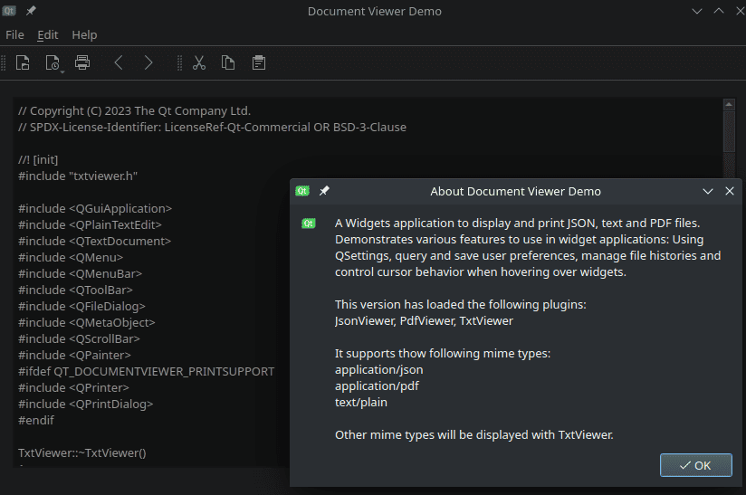

Document Viewer Example
=======================

A Widgets application to display and print JSON, text, and PDF files.

Document Viewer demonstrates how to use a :class:`~PySide6.QtWidgets.QMainWindow`
with static and dynamic toolbars, menus, and actions.

