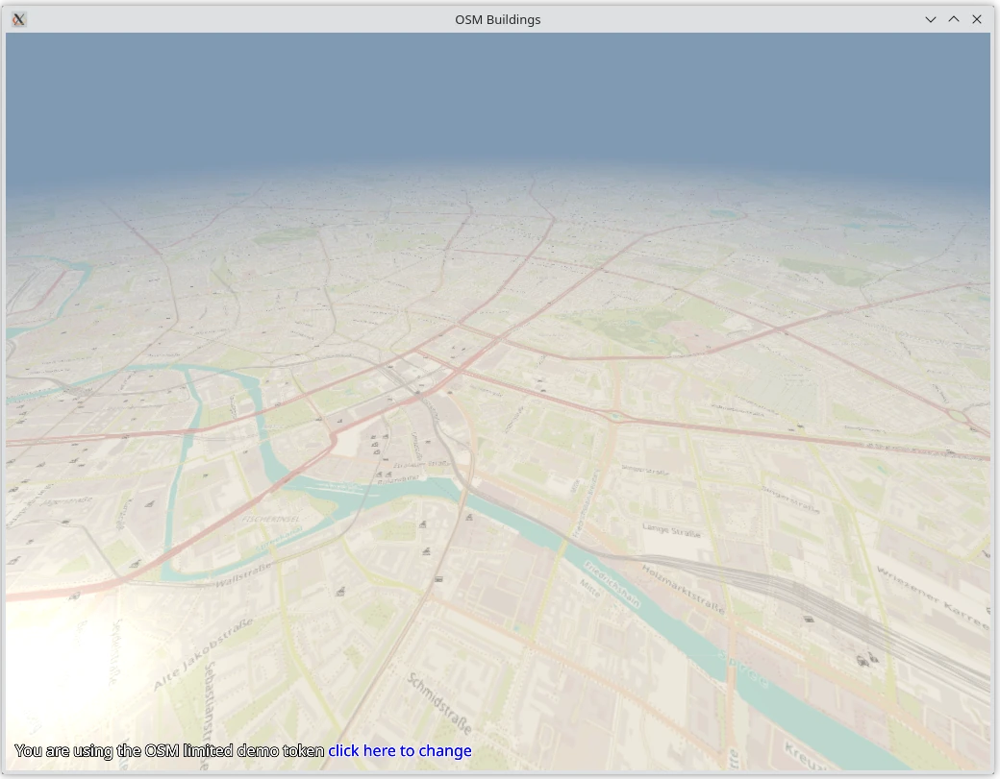

OSM Buildings
=============

This application shows a map obtained from OpenStreetMap (OSM) servers or a
locally limited data set when the server is unavailable using
:mod:`Qt Quick 3D <PySide6.QtQuick3D>`.

It is a subset of the equivalent C++ demo, which in addition displays
buildings. This functionality requires a special license key, though.

Queue handling
--------------

The application uses a queue to handle concurrent requests to boost up the
loading process of maps and building data.

Fetching and parsing data
-------------------------

A custom request handler class is implemented for fetching the data from the
OSM map servers.

The downloaded ``PNG`` data is sent to a custom ``QQuick3DTextureData`` item to
convert the ``PNG`` format to a texture for map tiles.

The application uses camera position, orientation, zoom level, and tilt to find
the nearest tiles in the view.

Controls
--------

When you run the application, use the following controls for navigation.

+---------+---------------------------+---------+
|         | Windows                   | Android |
+---------+---------------------------+---------+
| Pan     | Left mouse button + drag  | Drag    |
+---------+---------------------------+---------+
| Zoom    | Mouse wheel               | Pinch   |
+---------+---------------------------+---------+
| Rotate  | Right mouse button + drag | n/a     |
+---------+---------------------------+---------+

Rendering
---------

Every chunk of the map tile consists of a QML model (the 3D geometry) and a
custom material which uses a rectangle as a base to render the tilemap texture.

