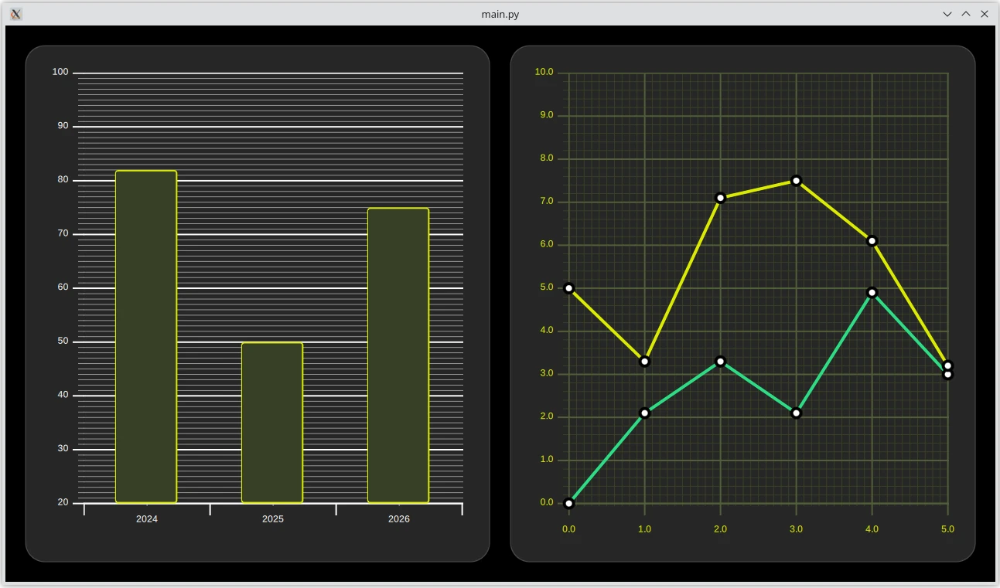

HelloGraphs Example
===================

The example shows how to make a simple 2D bar graph and line graph.

BarGraph
--------

The first graph in the example is a bar graph. Creating it starts with a GraphsView
component and setting the theme to one which is suitable on
dark backgrounds. This theme adjusts the graph background grid and axis lines and
labels.

To make this a bar graph, add a ``BarSeries.`` The X axis of the series is a
``BarCategoryAxis`` with 3 categories. We hide both the vertical grid and the
axis lines. The Y axis of the series is ``ValueAxis`` with visible range
between 20 and 100. Major ticks with labels will be shown on every 10 values
using the ``tickInterval`` property. Minor ticks will be shown on every 1
values setting the ``minorTickCount`` propertyt to 9, which means that between
every major ticks there will be 9 minor ones.

Then data is added into ``BarSeries`` using ``BarSet.`` There are 3 bars, and we define
custom bars color and border properties. These properties will override the possible
theme set for the ``AbstractSeries.``

LineGraph
---------

The second graph of the example is a line graph. It also starts by defining a
``GraphsView`` element. A custom ``GraphTheme`` is created to get a custom appearance.
``GraphTheme`` offers quite a wide range of customization possibilities for the background
grid and axis, which get applied after the ``colorTheme``.

A custom ``Marker`` component is used to visualize the data points.

The previous bar graph didn't define a separate ``SeriesTheme``, so it uses the
default theme. This line graph uses a custom theme with the desired line colors.

To make this a line graph, add a ``LineSeries.`` The first series defines
``axisX`` and ``axisY`` for this graph. It also sets the ``pointMarker`` to use
the custom ``Marker`` component that was created earlier. Data points are added
using ``XYPoint`` elements.

The second line series is similar to the first. The ``axisX`` and ``axisY``
don't need to be defined as the graph already contains them. As this is the
second ``LineSeries`` inside the ``GraphsView``, second color from the
``seriesTheme`` gets automatically picked.

