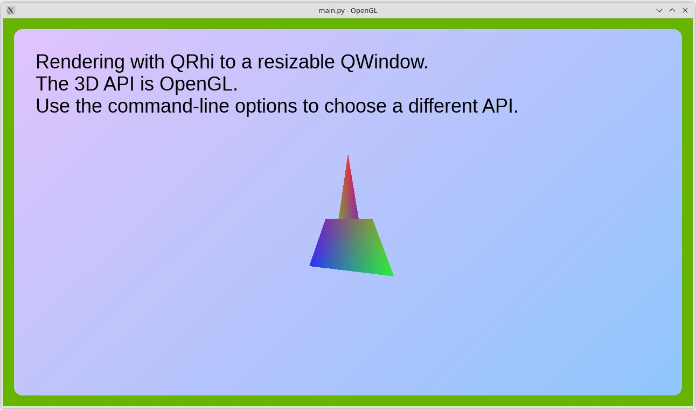

RHI Window Example
==================

This example shows how to create a minimal ``QWindow``-based
application using ``QRhi``.

Qt 6.6 starts offering its accelerated 3D API and shader abstraction layer for
application use as well. Applications can now use the same 3D graphics classes
Qt itself uses to implement the ``Qt Quick`` scenegraph or the ``Qt Quick`` 3D
engine. In earlier Qt versions ``QRhi`` and the related classes were all
private APIs. From 6.6 on these classes are in a similar category as QPA family
of classes: neither fully public nor private, but something in-between, with a
more limited compatibility promise compared to public APIs. On the other hand,
``QRhi`` and the related classes now come with full documentation similarly to
public APIs.

There are multiple ways to use ``QRhi``, the example here shows the most
low-level approach: targeting a ``QWindow``, while not using ``Qt Quick``, ``Qt
Quick 3D``, or Widgets in any form, and setting up all the rendering and
windowing infrastructure in the application.

In contrast, when writing a QML application with ``Qt Quick`` or ``Qt Quick
3D``, and wanting to add ``QRhi``-based rendering to it, such an application is
going to rely on the window and rendering infrastructure ``Qt Quick`` has
already initialized, and it is likely going to query an existing ``QRhi``
instance from the ``QQuickWindow``. There dealing with ``QRhi::create()``,
platform/API specifics or correctly handling ``QExposeEvent`` and resize events
for the window are all managed by Qt Quick. Whereas in this example, all that
is managed and taken care of by the application itself.

.. note:: For ``QWidget``-based applications, see the :ref:`rhi-widget-example`.

Shaders
-------

Due to being a Qt GUI/Python module example, this example cannot have a
dependency on the ``Qt Shader Tools`` module. This means that ``CMake`` helper
functions such as ``qt_add_shaders`` are not available for use. Therefore, the
example has the pre-processed ``.qsb`` files included in the
``shaders/prebuilt`` folder, and they are simply included within the executable
via a resource file}. This approach is not generally recommended for
applications.

