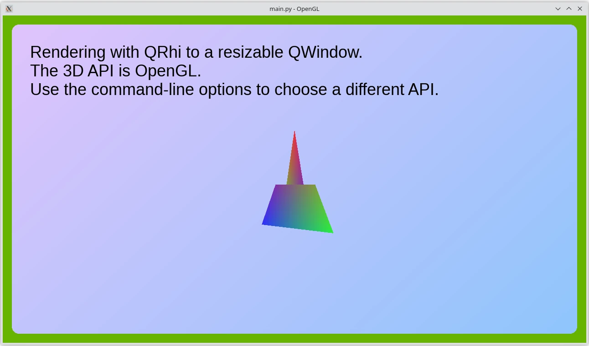

RHI Window Example
==================

This example shows how to create a minimal :class:`~PySide6.QtGui.QWindow`-based
application using :class:`~PySide6.QtGui.QRhi`.

Qt 6.6 starts offering its accelerated 3D API and shader abstraction layer for
application use as well. Applications can now use the same 3D graphics classes
Qt itself uses to implement the :mod:`~PySide6.QtQuick` scenegraph or the
:mod:`~PySide6.QtQuick3D` engine.
In earlier Qt versions :class:`~PySide6.QtGui.QRhi` and the related classes were all
private APIs. From 6.6 on these classes are in a similar category as QPA family
of classes: neither fully public nor private, but something in-between, with a
more limited compatibility promise compared to public APIs. On the other hand,
:class:`~PySide6.QtGui.QRhi` and the related classes now come with full documentation similarly to
public APIs.

There are multiple ways to use :class:`~PySide6.QtGui.QRhi`, the example here
shows the most low-level approach: targeting a :class:`~PySide6.QtGui.QWindow`,
while not using :mod:`~PySide6.QtQuick`, :mod:`~PySide6.QtQuick3D`, or Widgets
in any form, and setting up all the rendering and windowing infrastructure in the application.

In contrast, when writing a QML application with :mod:`~PySide6.QtQuick` or
:mod:`~PySide6.QtQuick3D`, and wanting to add :class:`~PySide6.QtGui.QRhi`-based
rendering to it, such an application is going to rely on the window and rendering infrastructure
:mod:`~PySide6.QtQuick` has already initialized, and it is likely going to query an existing
:class:`~PySide6.QtGui.QRhi` instance from the :class:`~PySide6.QtQuick.QQuickWindow`.
There dealing with :meth:`~PySide6.QtGui.QRhi.create()`,
platform/API specifics or correctly handling :class:`~PySide6.QtGui.QExposeEvent` and resize events
for the window are all managed by Qt Quick. Whereas in this example, all that
is managed and taken care of by the application itself.

.. note:: For ``QWidget``-based applications, see the :ref:`rhi-widget-example`.

Shaders
-------

Due to being a Qt GUI/Python module example, this example cannot have a
dependency on the ``Qt Shader Tools`` module. This means that ``CMake`` helper
functions such as ``qt_add_shaders`` are not available for use. Therefore, the
example has the pre-processed ``.qsb`` files included in the
``shaders/prebuilt`` folder, and they are simply included within the executable
via a resource file}. This approach is not generally recommended for
applications.

