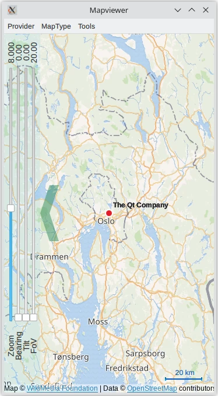

Map Viewer Example
==================

.. tags:: Android

The Map Viewer example shows how to display and interact with a map,
search for an address, and find driving directions.

This is a large example covering many basic uses of maps, positioning, and
navigation services in Qt Location.

