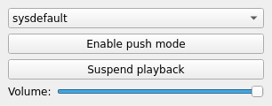

Audio Output Example
====================

.. tags:: Android

Audio Output demonstrates the basic use cases of QAudioOutput.

This example provides a tone generator to supply continuous audio playback. The
first button allows pause and resume of the playback, and the second button
allows toggling between push and pull modes of operation.

