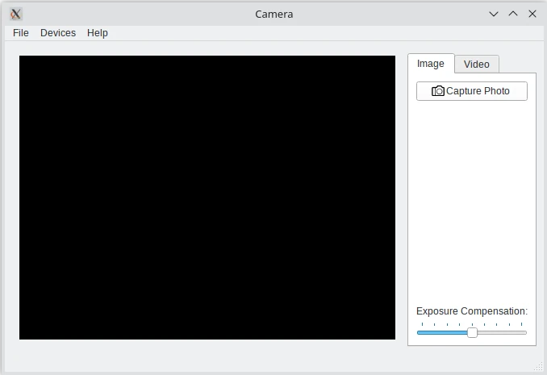

Camera Example
===============

.. tags:: Android

The Camera Example shows how to use the API to capture a still image or video.

The Camera Example demonstrates how you can use Qt Multimedia to implement some
basic Camera functionality to take still images and record video clips with
audio.

