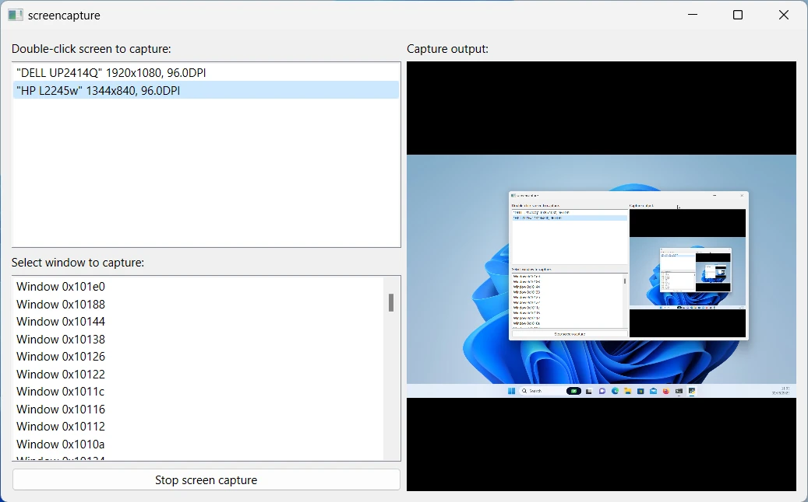

Screen Capture Example
======================

The Screen Capture Example demonstrates how to capture a screen or window using
QScreenCapture. It shows a list of screens and and displays a live preview of
the selected item using a ``QMediaCaptureSession`` and a ``QVideoWidget``.
There is a button to start and stop the capturing.

Application Structure
+++++++++++++++++++++

The example consists of two custom classes. The UI and all screen capture
functionality is implemented in the class ``ScreenCapturePreview``. The classes
``ScreenListModel`` serves as model behind the ``QListView``. The main function
creates a ``ScreenCapturePreview`` object, which in turn creates an instance of
``QScreenCapture``, ``QMediaCaptureSession`` and ``QVideoWidget`` in addition
to all the UI widgets.

The list model is populated with the return values of ``QGuiApplication.screens()``.

When a list item is selected it is connected to the ``QScreenCapture`` object
with ``QScreenCapture.setScreen()``. The ``QScreenCapture`` object is connected
to the ``QMediaCaptureSession`` object with
``QMediaCaptureSession.setScreenCapture()``, which in turn is connected to the
``QVideoWidget`` object with ``QMediaCaptureSession.setVideoOutput()`` Thus the
screen capture output is previewed in the video widget on the right hand side
of the UI.

The start/stop button calls ``QScreenCapture.start()`` and ``QScreenCapture.stop()``.

A ``QMessageBox`` pops up if the ``QScreenCapture.errorOccurred()`` signal is emitted.

