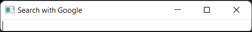

Google Suggest Example
======================

Obtains the list of search recommendations by the Google search engine.

The example uses the QNetworkAccessManager to obtain the list of search
recommendations by Google as the user types into a QLineEdit.

