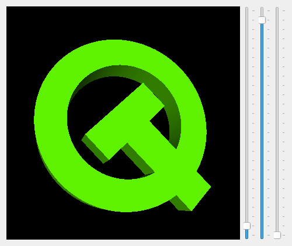

Hello GL2 Example
=================

The Hello GL2 example demonstrates the basic use of the OpenGL-related classes
provided with Qt.

In this example the widget's corresponding top-level window can change several
times during the widget's lifetime. Whenever this happens, the QOpenGLWidget's
associated context is destroyed and a new one is created, requiring us to clean
up the GL resources.

The equivalent C++ example does this cleanup on emission of the
QOpenGLContext.aboutToBeDestroyed() signal. However, in Qt for Python, we
cannot rely on this signal when it is emitted from the destructor.

Therefore, we do the cleanup in GLWidget.hideEvent().

This will be followed by an invocation of initializeGL() where we can recreate
all resources.

