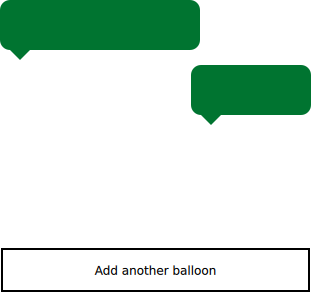

Scene Graph Painted Item Example
================================

.. tags:: Android

Shows how to implement QPainter-based custom scenegraph items.

The Painted Item example shows how to use the QML Scene Graph framework to
implement custom scenegraph items using QPainter.

