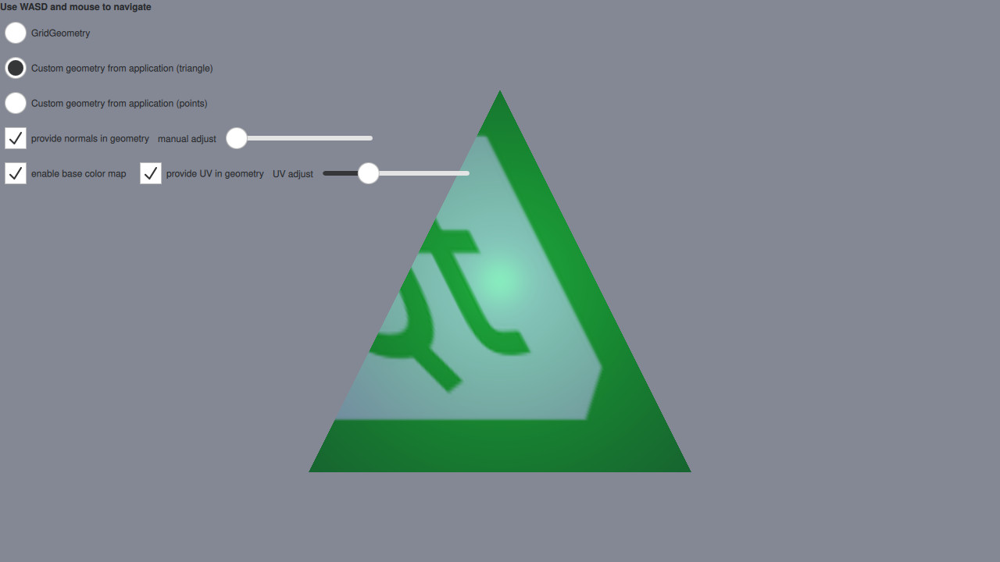

Custom Geometry Example
=======================

This example makes use of QQuick3DGeometry and the geometry property
of Model to render a mesh with vertex, normal, and
texture coordinates specified from Python instead of a pre-baked asset.

In addition, the GridGeometry is also demonstrated. GridGeometry is a
built-in QQuick3DGeometry implementation that provides a mesh with line
primitives suitable for displaying a grid.

The focus on this example will be on the code that provides the custom
geometry.

