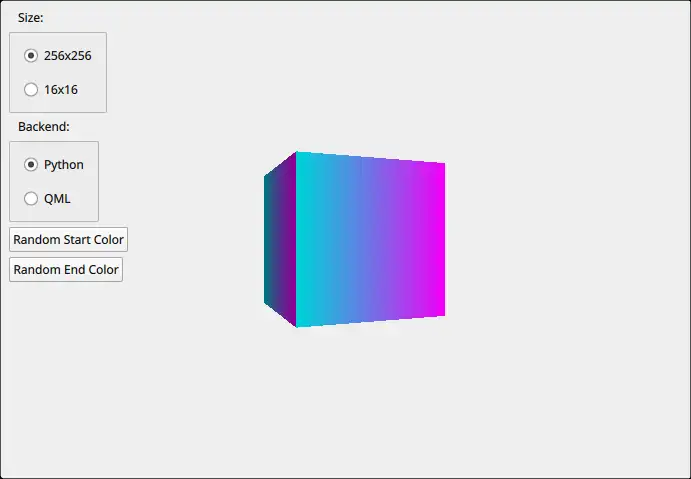

Procedural Texture Example
==========================

Demonstrates how to provide custom texture data from Python.

In this example, we leverage `QQuick3DTextureData` and the `textureData`
property of `Texture` to produce texture data dynamically from Python, rather
than sourcing it from a static asset.
