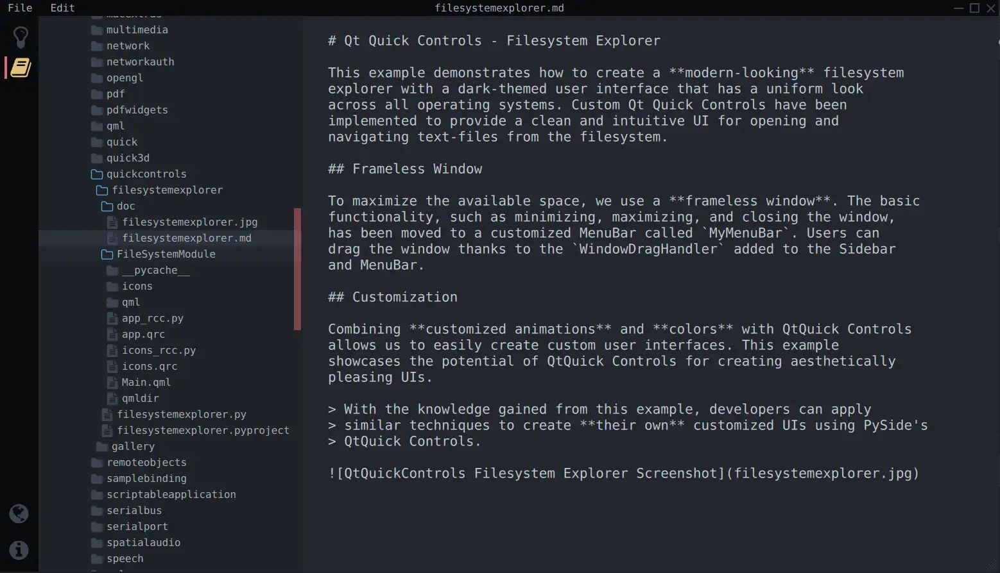

Qt Quick Controls - Filesystem Explorer
=======================================

This example demonstrates how to create a **modern-looking** filesystem
explorer with a dark-themed user interface that has a uniform look
across all operating systems. Custom Qt Quick Controls have been
implemented to provide a clean and intuitive UI for opening and
navigating text-files from the filesystem.

Frameless Window
----------------

To maximize the available space, we use a **frameless window**. The basic
functionality, such as minimizing, maximizing, and closing the window,
has been moved to a customized MenuBar called ``MyMenuBar``. Users can
drag the window thanks to the ``WindowDragHandler`` added to the Sidebar
and MenuBar.

Customization
-------------

Combining **customized animations** and **colors** with QtQuick Controls
allows us to easily create custom user interfaces. This example
showcases the potential of QtQuick Controls for creating aesthetically
pleasing UIs.

..

   With the knowledge gained from this example, developers can apply
   similar techniques to create **their own** customized UIs using PySide's
   QtQuick Controls.

References
----------

If you're interested in the C++ version of this example, you can find it
`here <https://doc-snapshots.qt.io/qt6-dev/qtquickcontrols-filesystemexplorer-example.html>`_.

Additionally, there is a detailed
`tutorial <https://doc.qt.io/qtforpython-6/tutorials/extendedexplorer/extendedexplorer.html>`_
available that provides step-by-step instructions on how to extend this example
with additional features. This tutorial can be helpful if you want to explore
and learn more about building upon the existing functionality of the filesystem
explorer.
