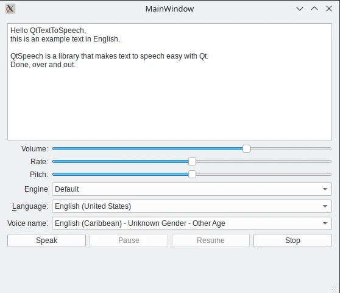

Hello Speak
===========

The Hello Speak example reads out user-provided text.

The Hello Speak example demonstrates how QTextToSpeech can be used in a Qt C++
application to read out text, and to control the speech.

The example uses a widget UI to provide controls for the pitch, volume, and
rate of the speech. It also lets the user select an engine, the language, and a
voice.

