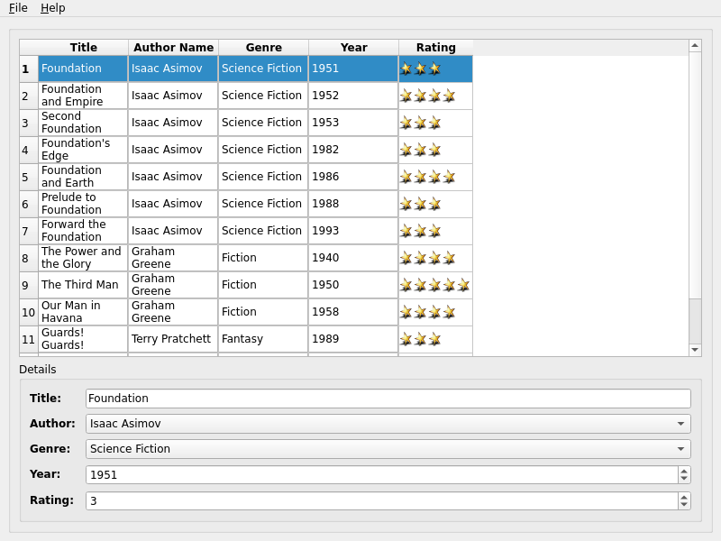

SQL Books Example
=================

Shows how to use Qt SQL classes with a model/view framework.

The Books example shows how Qt's SQL classes can be used with the model/view
framework to create rich user interfaces for information stored in a database.

