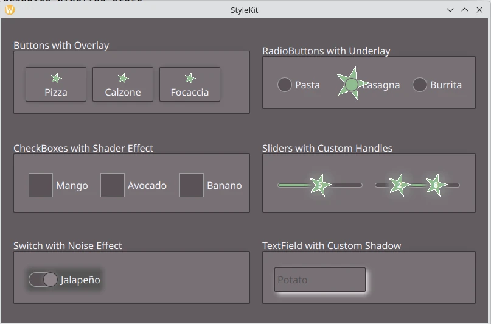

StyleKit Custom Delegates Example
=================================

A PySide6 application that demonstrates the analogous example in Qt
`StyleKit Custom Delegates Example`_.

This example shows how to extend `Qt Labs StyleKit`_ styling with
`custom delegates`_ that allow you to render a style beyond what the default
rendering provides.

It demonstrates how to:

* Create overlay delegates by subclassing `StyledItem`_ and placing custom
  items on top of the standard delegate rendering.
* Create underlay delegates using a plain `Item`_ with `delegateStyle` and
  `control` properties, embedding a `StyledItem`_ on top for the standard look.
* Pass per-state data to a custom delegate using the `data`_ property.
* Apply shader-based visual effects using `ShaderEffect`_ and `ShaderEffectSource`_
  in combination with `StyledItem`_.
* Implement a `custom shadow delegate`_ to replace the built-in shadow rendering.
* Pass static configuration to a delegate via regular QML properties (e.g.
  distinguishing the first and second handle of a `RangeSlider`_.

 .. note:: This example requires `Qt Shader Tools`_ module.

.. _`Qt Labs StyleKit`: https://doc.qt.io/qt-6/qtlabsstylekit-index.html
.. _`StyleKit Custom Delegates Example`: https://doc.qt.io/qt-6/qtlabsstylekit-stylekitcustomdelegates-example.html
.. _`data`: https://doc.qt.io/qt-6/qml-qt-labs-stylekit-delegatestyle.html#data-prop
.. _`StyledItem`: https://doc.qt.io/qt-6/qml-qt-labs-stylekit-styleditem.html
.. _`Item`: https://doc.qt.io/qt-6/qml-qtquick-item.html
.. _`custom delegates`: https://doc.qt.io/qt-6/qml-qt-labs-stylekit-delegatestyle.html#delegate-prop
.. _`Qt Shader Tools`: https://doc.qt.io/qt-6/qtshadertools-index.html
.. _`ShaderEffect`: https://doc.qt.io/qt-6/qml-qtquick-shadereffect.html
.. _`ShaderEffectSource`: https://doc.qt.io/qt-6/qml-qtquick-shadereffectsource.html
.. _`custom shadow delegate`: https://doc.qt.io/qt-6/qml-qt-labs-stylekit-delegatestyle.html#shadow-prop
.. _`RangeSlider`: https://doc.qt.io/qt-6/qml-qtquick-controls-rangeslider.html
