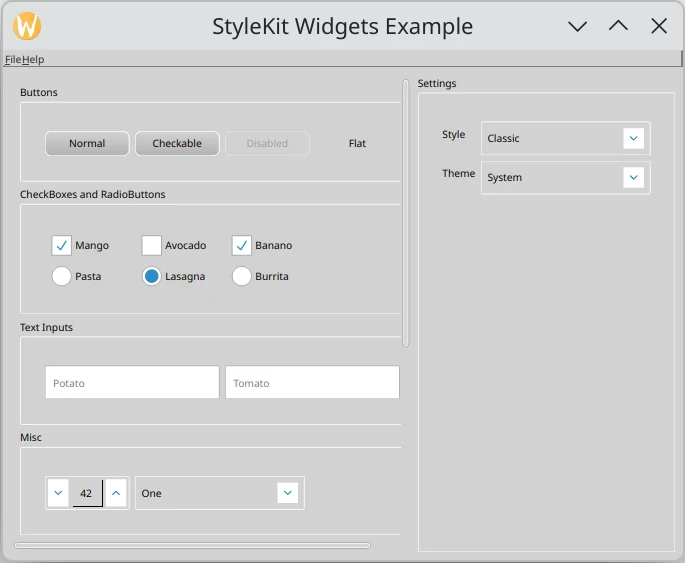

StyleKit Widgets Example
========================

 This example shows how to style a Qt Widgets application with
 `Qt Labs StyleKit`_. It demonstrates how to apply QML-defined
 styles to standard :mod:`~PySide6.QtWidgets` controls using
 :class:`~PySide6.QtLabsStyleKit.QStyleKitStyle`, and how
 to switch between styles and themes at runtime.

 The example includes three styles:

* `Classic` - A gradient-based style with multiple themes including light, dark, high-contrast,
  and green.
* `Flat` - A flat, Material Design-inspired style with light and dark themes.
* `Neon` - A cyberpunk-inspired dark style with neon accent colors.

 The example demonstrates how to:

* Apply a :class:`~PySide6.QtLabsStyleKit.QStyleKitStyle` to a
  :class:`~PySide6.QtWidgets.QApplication`.
* Switch between QML-defined styles at runtime using
  :meth:`~PySide6.QtLabsStyleKit.QStyleKitStyle.setStylePath`.
* Switch between themes within a style using
  :meth:`~PySide6.QtLabsStyleKit.QStyleKitStyle.setThemeName`.
* Organize widgets into labeled sections using :class:`~PySide6.QtWidgets.QGroupBox`.

.. _`Qt Labs StyleKit`: https://doc.qt.io/qt-6/qtlabsstylekit-index.html
