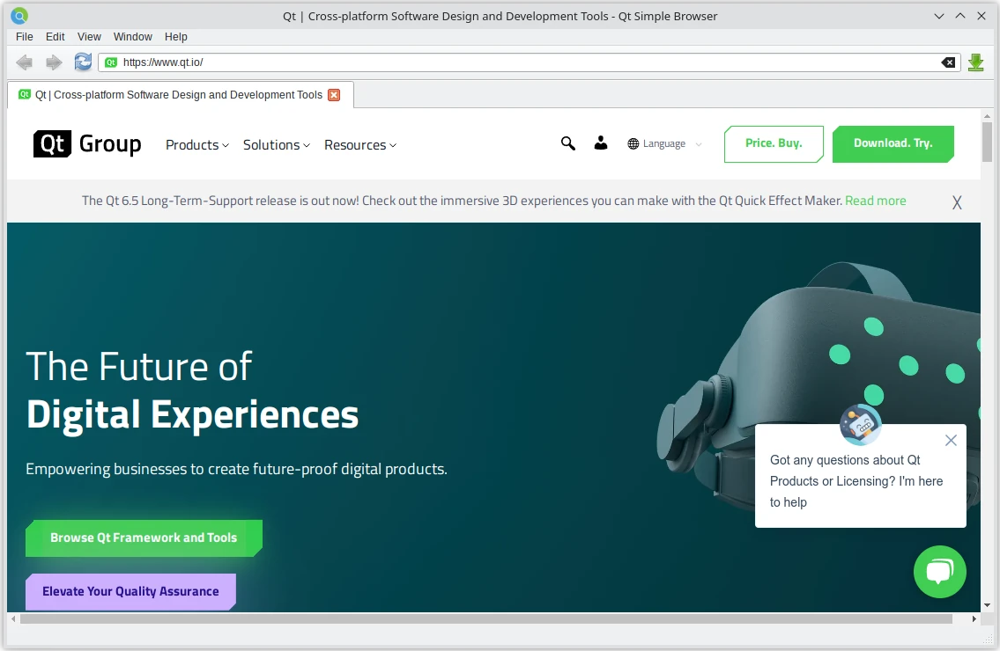

Simple Browser
==============

Simple Browser demonstrates how to use the Qt WebEngine Widgets classes to
develop a small Web browser application that contains the following elements:

- Menu bar for opening stored pages and managing windows and tabs.
- Navigation bar for entering a URL and for moving backward and
  forward in the web page browsing history.
- Multi-tab area for displaying web content within tabs.
- Status bar for displaying hovered links.
- A simple download manager.

The web content can be opened in new tabs or separate windows. HTTP and
proxy authentication can be used for accessing web pages.

Class Hierarchy
+++++++++++++++

We will implement the following main classes:

- ``Browser`` is a class managing the application windows.
- ``BrowserWindow`` is a ``QMainWindow`` showing the menu, a navigation
    bar, ``TabWidget``, and a status bar.
- ``TabWidget`` is a ``QTabWidget`` and contains one or multiple
    browser tabs.
- ``WebView`` is a ``QWebEngineView``, provides a view for ``WebPage``,
    and is added as a tab in ``TabWidget``.
- ``WebPage`` is a ``QWebEnginePage`` that represents website content.

Additionally, we will implement some auxiliary classes:

- ``WebPopupWindow`` is a ``QWidget`` for showing popup windows.
- ``DownloadManagerWidget`` is a ``QWidget`` implementing the downloads
    list.

Creating the Browser Main Window
++++++++++++++++++++++++++++++++

This example supports multiple main windows that are owned by a ``Browser``
object. This class also owns the ``DownloadManagerWidget`` and could be used
for further functionality, such as bookmarks and history managers.

In ``main.cpp``, we create the first ``BrowserWindow`` instance and add it
to the ``Browser`` object. If no arguments are passed on the command line,
we open the Qt Homepage.

To suppress flicker when switching the window to OpenGL rendering, we call
show after the first browser tab has been added.

Creating Tabs
+++++++++++++

The ``BrowserWindow`` constructor initializes all the necessary user interface
related objects. The centralWidget of ``BrowserWindow`` contains an instance of
``TabWidget``. The ``TabWidget`` contains one or several ``WebView`` instances
as tabs, and delegates it's signals and slots to the currently selected one.

In ``TabWidget.setup_view()``, we make sure that the ``TabWidget`` always
forwards the signals of the currently selected ``WebView``.

Implementing WebView Functionality
++++++++++++++++++++++++++++++++++

The class ``WebView`` is derived from ``QWebEngineView`` to support the
following functionality:

- Displaying error messages in case the render process dies
- Handling ``createWindow()`` requests
- Adding custom menu items to context menus

Managing WebWindows
-------------------

The loaded page might want to create windows of the type
``QWebEnginePage.WebWindowType``, for example, when a JavaScript program requests
to open a document in a new window or dialog. This is handled by overriding
``QWebView.createWindow()``.

In case of ``QWebEnginePage.WebDialog``, we create an instance of a custom
``WebPopupWindow`` class.

Adding Context Menu Items
-------------------------

We add a menu item to the context menu, so that users can right-click to have
an inspector opened in a new window. We override
``QWebEngineView.contextMenuEvent()`` and use
``QWebEnginePage.createStandardContextMenu()`` to create a default ``QMenu``
with a default list of ``QWebEnginePage.WebAction`` actions.

Implementing WebPage and WebView Functionality
+++++++++++++++++++++++++++++++++++++++++++++++

We implement ``WebPage`` as a subclass of ``QWebEnginePage`` and ``WebView`` as
as subclass of ``QWebEngineView`` to enable HTTP, proxy authentication, as well
as ignoring SSL certificate errors when accessing web pages.

In all the cases above, we display the appropriate dialog to the user. In
case of authentication, we need to set the correct credential values on the
QAuthenticator object.

The ``handleProxyAuthenticationRequired`` signal handler implements the very same
steps for the authentication of HTTP proxies.

In case of SSL errors, we just need to return a boolean value indicating
whether the certificate should be ignored.

Opening a Web Page
++++++++++++++++++

This section describes the workflow for opening a new page. When the user
enters a URL in the navigation bar and presses Enter, the
``QLineEdit.:returnPressed()`` signal is emitted and the new URL is then handed
over to ``TabWidget.set_url()``.

The call is forwarded to the currently selected tab.

The ``set_url()`` method of ``WebView`` just forwards the url to the associated
``WebPage``, which in turn starts the downloading of the page's content in the
background.

Implementing Private Browsing
+++++++++++++++++++++++++++++

*Private browsing*, *incognito mode*, or *off-the-record* mode is a feature of
many browsers where normally persistent data, such as cookies, the HTTP cache,
or browsing history, is kept only in memory, leaving no trace on disk. In this
example we will implement private browsing on the window level with tabs in one
window all in either normal or private mode. Alternatively we could implement
private browsing on the tab-level, with some tabs in a window in normal mode,
others in private mode.

Implementing private browsing is quite easy using Qt WebEngine. All one has to
do is to create a new ``QWebEngineProfile`` and use it in the
``QWebEnginePage`` instead of the default profile. In the example, this new
profile is owned by the ``Browser`` object.

The required profile for *private browsing* is created together with its first
window. The default constructor for ``QWebEngineProfile`` already puts it in
*off-the-record* mode.

All that is left to do is to pass the appropriate profile down to the
appropriate ``QWebEnginePage`` objects. The ``Browser`` object will hand to
each new ``BrowserWindow`` either the global default profile or one shared
*off-the-record* profile instance.

The ``BrowserWindow`` and ``TabWidget`` objects will then ensure that all
``QWebEnginePage`` objects contained in a window will use this profile.

Managing Downloads
++++++++++++++++++

Downloads are associated with a ``QWebEngineProfile``. Whenever a download is
triggered on a web page the ``QWebEngineProfile.downloadRequested`` signal is
emitted with a ``QWebEngineDownloadRequest``, which in this example is
forwarded to ``DownloadManagerWidget.download_requested()``.

This method prompts the user for a file name (with a pre-filled suggestion) and
starts the download (unless the user cancels the ``Save As`` dialog).

The ``QWebEngineDownloadRequest`` object will periodically emit the
``QWebEngineDownloadRequest.receivedBytesChanged()`` signal to notify potential
observers of the download progress and the
``QWebEngineDownloadRequest.stateChanged()`` signal when the download is
finished or when an error occurs.

Files and Attributions
++++++++++++++++++++++

The example uses icons from the `Tango Icon Library`_.

.. _`Tango Icon Library`: http://tango.freedesktop.org/Tango_Icon_Library
