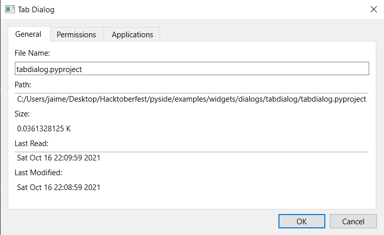

Tab Dialog Example
===================

Shows how to construct a tab dialog using the QTabWidget class.

The Tab Dialog example consists of a single TabDialog class
that provides three tabs, each containing information about
a particular file, and two standard push buttons that are
used to accept or reject the contents of the dialog.

