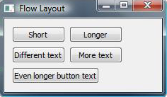

Flow Layout Example
===================

Flow Layout implements a layout that handles different window sizes
in a Qt Widgets application.
The widget placement changes depending on the width of the application
window.

