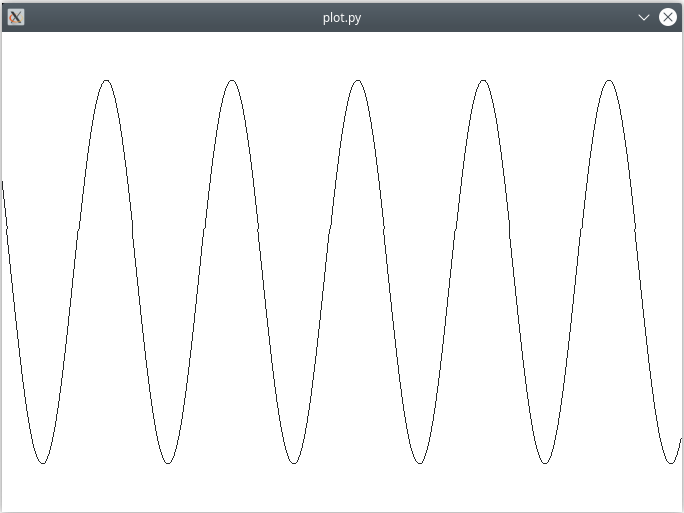

Plot Example
============

The Plot example shows how to display a graph from data using an
`opaque container <https://doc.qt.io/qtforpython-6/shiboken6/typesystem_containers.html>`_.

It draws an sine graph using ``QPainter.drawPolyline()`` from a list of points.
The list of points is continuously updated, as is the case for a example for a
graph of an oscilloscope or medical patient monitor.
In this case, it makes sense from a performance point of view to avoid the
conversion of a Python list of data to a C++ list (``QList<QPoint>``)
for each call to the plot function ``QPainter.drawPolyline()``.
This is where opaque containers come into play.

Instead of Python list of points, a ``QPointList`` is instantiated to store
the data. ``QPointList`` is an opaque container wrapping a ``QList<QPoint>``.
It can be passed to ``QPainter.drawPolyline()`` instead of a Python list of
points.

The type is declared in the entry for the ``QList`` container type in the
type system file of the ``QtCore`` library:

.. code-block:: xml

    <container-type name="QList" type="list"
                    opaque-containers="int:QIntList;QPoint:QPointList;QPointF:QPointFList">
        ...
    </container-type>

In the ``shift()`` member function, new data are appended to the list while
old data moving out of the visible window are removed from the front of the
list.

