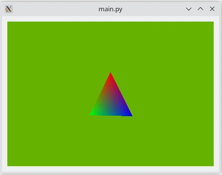

Simple RHI Widget Example
=========================

Shows how to render a triangle using ``QRhi``, Qt's 3D API and shading
language abstraction layer.

This example is, in many ways, the counterpart of the :ref:`example_gui_rhiwindow`
in the QWidget world. The ``QRhiWidget`` subclass in this applications renders
a single triangle, using a simple graphics pipeline with basic vertex and
fragment shaders. Unlike the plain ``QWindow``-based application, this example
does not need to worry about lower level details, such as setting up the window
and the ``QRhi``, or dealing with swapchain and window events, as that is taken
care of by the ``QWidget`` framework here. The instance of the ``QRhiWidget``
subclass is added to a ``QVBoxLayout``. To keep the example minimal and
compact, there are no further widgets or 3D content introduced.

Once an instance of ``ExampleRhiWidget``, a ``QRhiWidget`` subclass, is added
to a top-level widget's child hierarchy, the corresponding window automatically
becomes a Direct 3D, Vulkan, Metal, or OpenGL-rendered window. The
``QPainter``-rendered widget content, i.e. everything that is not a
``QRhiWidget``, ``QOpenGLWidget``, or ``QQuickWidget``, is then uploaded to a
texture, whereas the mentioned special widgets each render to a texture. The
resulting set textures is composited together by the top-level widget's
backingstore.

As opposed to the C++ example, the cleanup is done by reimplementing
``QRhiWidget.releaseResources()``, which is called from QWidget.closeEvent() of
the top level widget to ensure a deterministic cleanup sequence.

