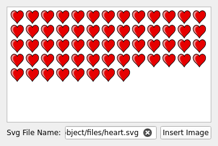

TextObject Example
==================

A QTextDocument consists of a hierarchy of elements, such as text blocks and
frames. A text object describes the structure or format of one or more of these
elements. For instance, images imported from HTML are implemented using text
objects. Text objects are used by the document's layout to lay out and render
(paint) the document. Each object knows how to paint the elements they govern,
and calculates their size.

To be able to insert an SVG image into a text document, we create a text
object, and implement painting for that object. This object can then be set on
a QTextCharFormat. We also register the text object with the layout of the
document, enabling it to draw QTextCharFormats governed by our text object. We
can summarize the procedure with the following steps:

 * Implement the text object.
 * Register the text object with the layout of the text document.
 * Set the text object on a QTextCharFormat.
 * Insert a QChar::ObjectReplacementCharacter with that text char format into
   the document.

The example consists of the following classes:

 * SvgTextObject implements the text object.
 * Window shows a QTextEdit into which SVG images can be inserted.

