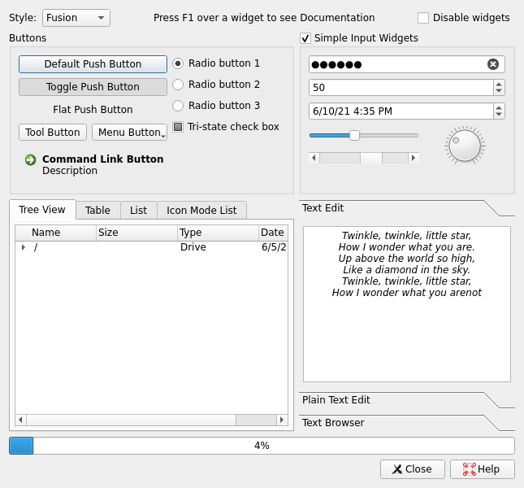

Widgets Gallery Example
=======================

Qt's support for widget styles and themes enables your application to fit in
with the native desktop environment.

The widgets examples show how some of the widgets available in Qt might appear
when configured to use the a particular style. Each style is only available on
the respective platfom, and provides native look and feel by integrating to the
platform theme. Thus, the final appearance varies depending on the active
theme.

