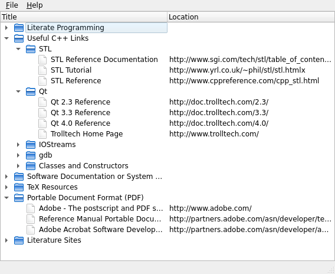

DOM Bookmarks Example
=====================

Provides a reader for XML Bookmark Exchange Language files.

The DOM Bookmarks example provides a reader for XML Bookmark Exchange Language
(XBEL) files that uses Qt's DOM-based XML API to read and parse the files. The
SAX Bookmarks example provides an alternative way to read this type of file.

