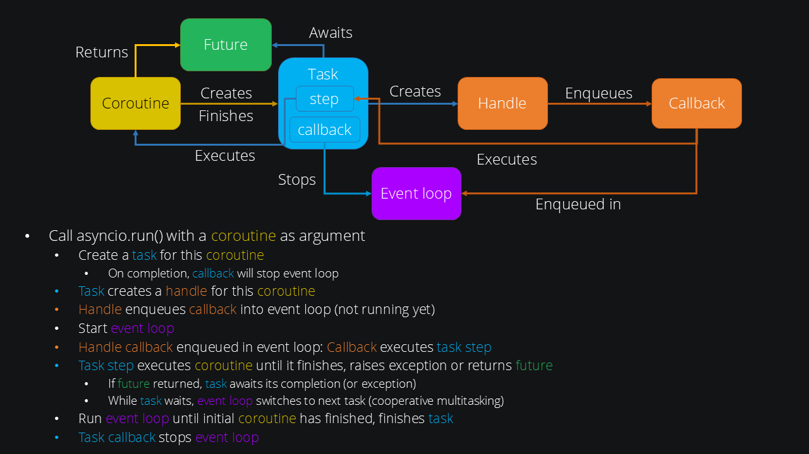

.. module:: PySide6.QtAsyncio

PySide6.QtAsyncio
*****************

.. note:: This module is currently in technical preview.

The Qt Asyncio module is a pure Python module that allows programs to be
written that use Qt's API in conjunction with `asyncio
<https://docs.python.org/3/library/asyncio.html>`_. asyncio is a popular
Python library for asynchronous programming. It is used in particular
for programs that need to handle many I/O operations from many sources,
such as web servers. More generally, it allows developers to work with
`couroutines <https://docs.python.org/3/library/asyncio-task.html#coroutine>`_.
Coroutines can be imagined as "asynchronous functions". In contrast to
Qt's signals and slot mechanism, this allows for asynchronous programs
that are closer in program flow to synchronous programs, as programs no
longer have to be imagined as a series of callbacks. Instead, coroutines
transparently resume and yield at designated spots.

Consider the following simple coroutine defined with the ``async``
keyword in front of its definition:

::

    async def do_something():
        result = await do_something_asynchronously()
        print(result)

``do_something_asynchronously()`` is a coroutine itself, e.g., an
I/O-heavy operation that would normally block the execution flow in a
synchronous program. Instead, the ``await`` keyword is used to wait for
the result, at which point ``do_something()`` yields and the program
flow transparently switches to the next asynchronous task. When the
result becomes available, the program flow is able to switch back to the
``do_something()`` coroutine, which then resumes and prints the result.

The asyncio API
^^^^^^^^^^^^^^^

asyncio and Qt are both based on an event loop. asyncio provides an API
to replace its default event loop with a custom implementation.
**QtAsyncio** provides such an implementation that uses Qt's event loop,
allowing Qt and asyncio to be used together.

We consider that this API consists of two levels:

1.  Fundamental infrastructure for event loops and asynchronous
    operations, including `futures
    <https://docs.python.org/3/library/asyncio-future.html#asyncio.Future>`_,
    `tasks <https://docs.python.org/3/library/asyncio-task.html#asyncio.Task>`_,
    `handles <https://docs.python.org/3/library/asyncio-eventloop.html#callback-handles>`_,
    executors, and event loop management functions (see below).
2.  A user-facing API for use in applications, including transports and
    protocols, network connections, servers, sockets, signals,
    subprocesses.

**QtAsyncio** currently covers the first level. This includes the
following functions, for which the API is identical with QtAsyncio as
with asyncio:

* `run_until_complete() <https://docs.python.org/3/library/asyncio-eventloop.html#asyncio.loop.run_until_complete>`_
* `run_forever() <https://docs.python.org/3/library/asyncio-eventloop.html#asyncio.loop.run_forever>`_
* `stop() <https://docs.python.org/3/library/asyncio-eventloop.html#asyncio.loop.stop>`_
* `is_running() <https://docs.python.org/3/library/asyncio-eventloop.html#asyncio.loop.is_running>`_
* `is_closed() <https://docs.python.org/3/library/asyncio-eventloop.html#asyncio.loop.is_closed>`_
* `close() <https://docs.python.org/3/library/asyncio-eventloop.html#asyncio.loop.close>`_
* `shutdown_asyncgens() <https://docs.python.org/3/library/asyncio-eventloop.html#asyncio.loop.shutdown_asyncgens>`_
* `shutdown_default_executor() <https://docs.python.org/3/library/asyncio-eventloop.html#asyncio.loop.shutdown_default_executor>`_
* `call_soon() <https://docs.python.org/3/library/asyncio-eventloop.html#asyncio.loop.call_soon>`_
* `call_soon_threadsafe() <https://docs.python.org/3/library/asyncio-eventloop.html#asyncio.loop.call_soon_threadsafe>`_
* `call_later() <https://docs.python.org/3/library/asyncio-eventloop.html#asyncio.loop.call_later>`_
* `call_at() <https://docs.python.org/3/library/asyncio-eventloop.html#asyncio.loop.call_at>`_
* `time() <https://docs.python.org/3/library/asyncio-eventloop.html#asyncio.loop.time>`_
* `create_future() <https://docs.python.org/3/library/asyncio-eventloop.html#asyncio.loop.create_future>`_
* `create_task() <https://docs.python.org/3/library/asyncio-eventloop.html#asyncio.loop.create_task>`_
* `set_task_factory() <https://docs.python.org/3/library/asyncio-eventloop.html#asyncio.loop.set_task_factory>`_
* `get_task_factory() <https://docs.python.org/3/library/asyncio-eventloop.html#asyncio.loop.get_task_factory>`_

Also included is the ability to
`run synchronous code in an executor <https://docs.python.org/3/library/asyncio-eventloop.html#asyncio.loop.run_in_executor>`_
(``ThreadPoolExecutor``).

Get started with QtAsyncio
^^^^^^^^^^^^^^^^^^^^^^^^^^

To write a program with **QtAsyncio**, first import the module, e.g.:

::

    import PySide6.QtAsyncio as QtAsyncio

**QtAsyncio** provides a function ``run()`` that can be used to run a
specific coroutine until it is complete, or to start the Qt & asyncio
event loop plainly. The former case makes sense if the program flow
starts with said coroutine, the latter case makes sense if a coroutine
is enqueued later in the program flow, e.g., after pressing a button in
the UI.

::

    QtAsyncio.run()

(see the `asyncio "minimal" example <https://doc.qt.io/qtforpython-6/examples/example_async_minimal.html>`_
for an instance of this usage) or

::

    QtAsyncio.run(my_coroutine())

(see the `asyncio "Eratosthenes" example <https://doc.qt.io/qtforpython-6/examples/example_async_eratosthenes.html>`_)
or

::

    QtAsyncio.run(my_coroutine(), keep_running=False)

to run the coroutine and then stop the event loop upon its completion.
This latter case behaves identically to ``asyncio.run(my_coroutine())``.

If there is no instance of a QCoreApplication, QGuiApplication or
QApplication yet, a new instance of QCoreApplication is created.

An additional optional argument ``quit_qapp`` can be passed to ``run()``
to configure whether the QCoreApplication at the core of QtAsyncio
should be shut down when asyncio finishes. A special case where one
would want to disable this is test suites that want to reuse a single
QCoreApplication instance across all unit tests, which would fail if
this instance is shut down every time. The default is ``True``.

Note that this argument is orthogonal to the ``keep_running`` argument.
``keep_running`` determines if **asyncio** should keep running after the
coroutine has finished, while ``quit_qapp`` determines if the
QCoreApplication should be shut down after asyncio has finished. It is
possible for asyncio to finish while the QCoreApplication is kept alive.

An argument ``handle_sigint`` determines whether QtAsyncio should handle
SIGINT (Ctrl+C) and shut down the event loop when it is received. The
default is ``False``. Set this to ``True`` if you want QtAsyncio to take
care of handling SIGINT instead of your program.

Coroutines explained
^^^^^^^^^^^^^^^^^^^^

Coroutines are functions that can be paused (yield) and resumed. Behind
this simple concept lies a complex mechanism that is abstracted by the
asynchronous framework. `This talk <https://www.youtube.com/watch?v=XuqdTvisqkQ>`_
presents the below diagram that attempts to illustrate the flow of a
coroutine from the moment it's provided to the async framework until
it's completed.

