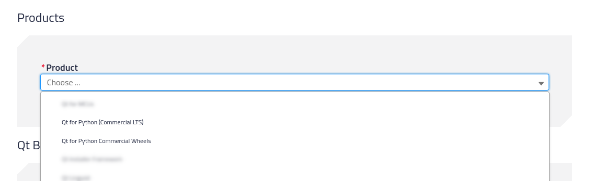
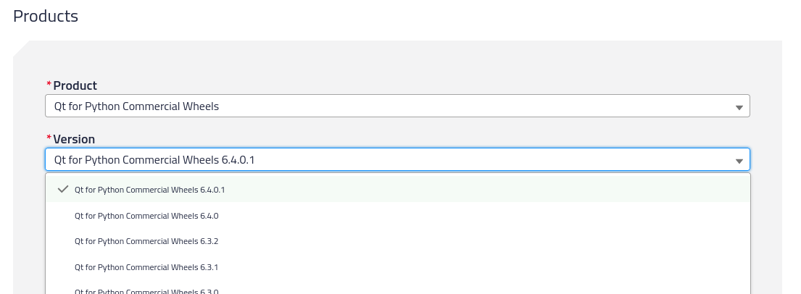
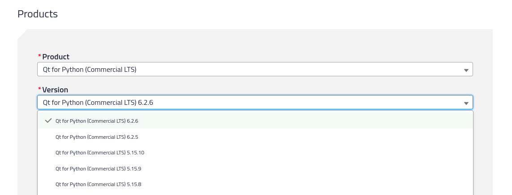
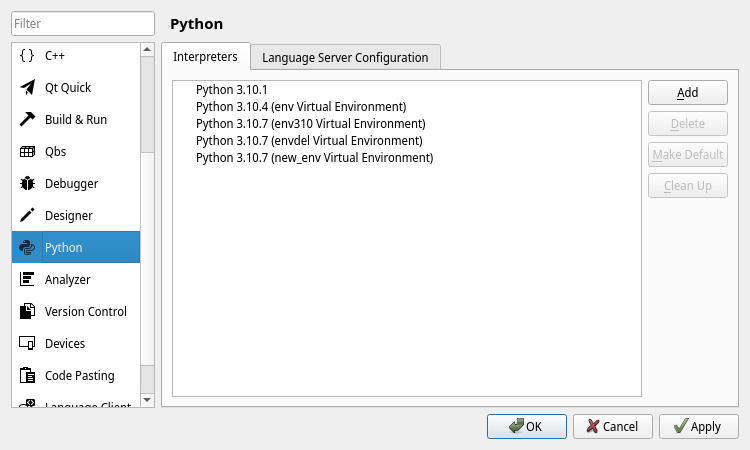

.. _commercial-page:

Commercial Distribution
=======================

|project| follows the same licensing that Qt has, which means that there are two
distributions, the Community Edition (LGPLv3/GPLv3) and a Commercial Edition. For
more information, check the `Qt Licensing`_ page.

As a brief description, you can get the commercial |project| packages by having
any of the following licenses:

#. Qt for Application Development Professional (ADP)
#. Qt for Application Development Enterprise (ADE)
#. Qt for Device Creation Professional (DCP)
#. Qt for Device Creation Enterprise (DCE)

The only difference is that the ADP license **does not** include the extra
``Qt OPC UA``,  ``Qt MQTT`` and ``Qt CoAP`` modules, which are distributed in
a special Python wheel.

All commercial licenses include the 5.15.x and 6.2.x LTS releases.

Commercial users **should not** install the Community Edition distribution via ``pip
install pyside6`` to avoid licensing problems, and should refer to the
packages provided in the `Qt Account`_.

Installation
------------

Head to your `Qt Account`_ page, and select the **Download** option on the side
menu. You will find an option to select |project| from the **Products**
section:

There are two options that will list a different set of packages:

* **Qt for Python Commercial wheels** which are the non-LTS releases under
  commercial licensing, and include commercial only features and tools.
  Additionally, here is where you can find the *Qt for automation (M2M
  Protocols)* packages.

* **Qt for Python (Commercial LTS)** where you will find the 5.15.x LTS and 6.2.x
  LTS releases.

Once you select any of those, you will be able to select the version of the
packages you want to download for the **Qt for Python Commercial wheels** packages:

and the **Qt for Python (Commercial LTS)** packages:

For any of the versions, you can download many packages depending on your
Operating System (macOS, Windows, or Linux). To learn more about what the
packages contain, please check the :ref:`package_details` page.

Once you download the packages, you are encouraged to create a Python virtual
environment to install them - check the ref:`quick-start` page for how to do
it.
With your activated environment on a terminal, run the following command (for
macOS/Linux)::

    pip install *.whl

to install them all, and leave ``pip`` to resolve the dependencies among the
packages, or for Windows do it by hand selecting the proper combination::

    pip install shiboken6-... PySide6_Essentials-... PySide6-Addons... ...

Alternatively for Windows, you can specify the following command which includes
the version, and assumes that you are running it on the same directory where
the wheels are::

    pip install --no-index --find-links=. PySide6==6.4.0.commercial

.. note:: As described in the :ref:`package_details` page, the dependency
   of the packages requires you to first install the ``shiboken6``
   package, and then ``shiboken6-generator`` in case you are interested
   on binding generation; or ``PySide6_Essentials`` in case you want
   to use the essential modules. After the Essentials, you can optionally
   install the ``PySide6_Addons`` and ``PySide6_M2M`` depending on your
   needs.

Qt Creator Integration
----------------------

Qt Creator offers the option to create new |project| projects from the main
wizard.

To execute the projects, make sure that the proper *Python Interpreter* is
selected, so Qt Creator can use the commercial modules you just installed.
Go to *Edit -> Preferences* where you can find the *Python* option
that will show the following:

you can add, remove and modify environments. To include a new one, make sure to
select the main Python executable from your environment. This can be found on
``path_to_your_env/bin/python`` (macOS and Linux), or
``path_to_your_env\python.exe`` (Windows).

As an alternative, you can launch Qt Creator from within the virtual
environment, detecting your installation automatically.

Migrating from other versions
-----------------------------

In case you have a virtual environment with the Open Source distribution, you
need to first uninstall those packages with the ``pip uninstall <package>``
command.

To check if packages are installed, run ``pip list`` and look for
``shiboken`` or ``PySide`` packages.

We always recommend creating a new virtual environment, so in doubt it is
better to just remove the old ones if you have previous installations. The
nature of virtual environments is volatile by design.

Python Workflow
---------------

The Qt framework is a C++ framework that we expose to Python with the help of
Shiboken (binding generator), which allows us to create the PySide Python module.

|project| tries to find a middle ground between how C++ and Python projects
work, so there are many decisions that need to be made, one of them being that
the distributing of the packages needs to follow the same Python workflow,
which means creating Python packages (wheels) and distributing them in a way
people can use the ``pip`` tool to install them.

PyPi is the main platform to distribute Open Source packages, but when
commercial packages are required the situation is different. Among all the
alternatives we had, we initially decided to provide the packages (wheels) on
the `Qt Account`_ platform, so people can download and install on demand, but
we are investigating simple ways to improve this process.

There have also been discussions regarding including |project| in the *Qt
Maintenance Tool* but this creates a new level of complexity. The reasoning is
that the tool would require people to select or create a Python virtual
environment on a separate location for this to be installed. Additionally,
the Python workflow considers virtual environments as very volatile. This means
they get removed and created often, so reinstalling or updating the |project|
packages will likely happen.

.. _`Qt Licensing`: https://www.qt.io/licensing/
.. _`Qt Account`: https://account.qt.io

