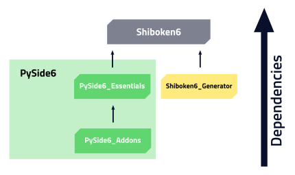

.. _package_details:

Package Details
===============

Having a large project as the Qt Framework available from one simple
installation line::

    pip install pyside6

is really beneficial,
but it might be confusing to newcomers.

Besides your IDE, you don't need to install anything else to develop your
Qt application, because the same command installs many tools
that will help you design UIs, use QML types, generate
files automatically, translate applications, etc.

Package Dependencies
--------------------

Starting from 6.3.0, the ``pyside6`` package (wheel) is almost empty,
and only includes references to other packages that are required
to properly use all the modules.
This packages are:

* ``pyside6-essentials``, `essential Qt modules <https://pypi.org/project/PySide6-Essentials/>`_,
* ``pyside6-addons``, `additional Qt modules <https://pypi.org/project/PySide6-Addons/>`_,
* ``shiboken6``, a utility Python module.

You can verify this by running ``pip list`` to check the installed
packages in your Python (virtual) environment::

  (env) % pip list
  Package            Version
  ------------------ -------
  pip                22.0.4
  PySide6            6.3.0
  PySide6-Addons     6.3.0
  PySide6-Essentials 6.3.0
  setuptools         58.1.0
  shiboken6          6.3.0

Both ``pyside6-essentials`` and ``pyside6-addons`` contain Qt binaries
(``.so``, ``.dll``, or ``.dylib``) that are used by the Python wrappers
that enable you to use the Qt modules from Python.
For example, in the ``QtCore`` module, you will find
on Linux:

* ``PySide6/QtCore.abi3.so``, and
* ``PySide6/Qt/lib/libQt6Core.so.6``

inside the ``site-packages`` directory of your (virtual) environment.
The first is the *importable* module which depends on the second file
which is the original QtCore library.

.. note:: The package ``shiboken6-generator`` is not a dependency,
   and it's not available on PyPi. The reason, is that it depends on
   ``libclang``, which is a large library that we don't package, and
   requires a special configuration for you to use. Check the `Shiboken
   Documentation`_ for more details.

..
  Adding the full URL because it's a different sphinx project.
.. _`Shiboken Documentation`: https://doc.qt.io/qtforpython/shiboken6/gettingstarted.html

Tools Included
--------------

Following the same idea from the modules, we also include in the packages
(wheels) Qt tools that are important for any Qt application development
workflow, like ``uic``, ``rcc``, etc.

All the tools **must** be used from the PySide wrappers, and not directly.
For example, if exploring the ``site-packages/`` directory on your installation
you find ``uic.exe`` (on Windows), you should not click on that, and use
``pyside6-uic.exe`` instead.
The reason for this is the proper setup of PATHs, plugins, and more,
to properly work with the installed Python package.

Here you can find all the tools we include in |project| starting
from 6.3.0, grouped by different topics:

Project development
~~~~~~~~~~~~~~~~~~~

* ``pyside6-project``, to build Qt Designer forms (``.ui`` files),
  resource files (``.qrc``) and QML type files (``.qmltype``) from
  a ``.pyproject`` file.

Widget Development
~~~~~~~~~~~~~~~~~~

* ``pyside6-designer``, drag-and-drop tool for designing Widget UIs (generates ``.ui`` files,
    see :ref:`using_ui_files`).
* ``pyside6-uic``, to generate Python code from ``.ui`` form files.
* ``pyside6-rcc``, to generate serialized data from ``.qrc`` resources files.
  Keep in mind these files can be used in other non-widget projects.

QML Development
~~~~~~~~~~~~~~~

* ``pyside6-qmllint``, that verifies the syntactic validity of QML files.
* ``pyside6-qmltyperegistrar``, to read metatypes files and generate
  files that contain the necessary code to register all the types marked with
  relevant macros.
* ``pyside6-qmlimportscanner``, to identify the QML modules imported from a
    project/QML files and dump the result as a JSON array.
* ``pyside6-qmlcachegen``, to compile QML to bytecode at compile time for bundling inside the
    binary.

Translations
~~~~~~~~~~~~

* ``pyside6-linguist``, for translating text in applications.
* ``pyside6-lrelease``, to create run-time translation files for the application.
* ``pyside6-lupdate``, to synchronize source code and translations.

Qt Help
~~~~~~~

* ``pyside6-assistant``, for viewing online documentation in Qt Help file format.
  Read more about the formats on the `QtHelp Framework`_ page.

.. _`QtHelp Framework`: https://doc.qt.io/qt-6/qthelp-framework.html

PySide Utilities
~~~~~~~~~~~~~~~~

* ``pyside6-genpyi``, to generate Python stubs (``.pyi`` files) for Qt modules.
* ``pyside6-metaobjectdump``, a tool to print out the metatype information in
  JSON to be used as input for ``qmltyperegistrar``.

Deployment
~~~~~~~~~~

* ``pyside6-deploy``, to deploy PySide6 applications to desktop platforms -
  Linux, Windows and macOS.
* ``pyside6-android-deploy``, to deploy PySide6 application as an Android app
  targeting different Android platforms - aarch64, armv7a, i686, x86_64.
