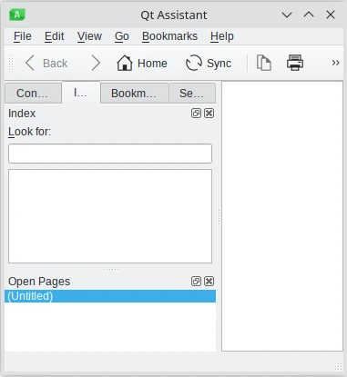

.. _pyside6-assistant:

pyside6-assistant
=================

``pyside6-assistant`` is a tool that wraps `Qt Assistant`_, the help
viewer of Qt for use with the Qt help file format (see `The Qt Help Framework`_).

The version of assistant shipped with Qt for Python does not contain
any documentation.

You can build the Qt for Python documentation in the Qt help file format
(see :ref:`building_documentation`) and register it for use in `Preferences`
dialog of ``pyside6-assistant`` (`Edit/Preferences`).

.. _`Qt Assistant`: https://doc.qt.io/qt-6/qtassistant-index.html
.. _`The Qt Help Framework`: https://doc.qt.io/qt-6/qthelp-framework.html
