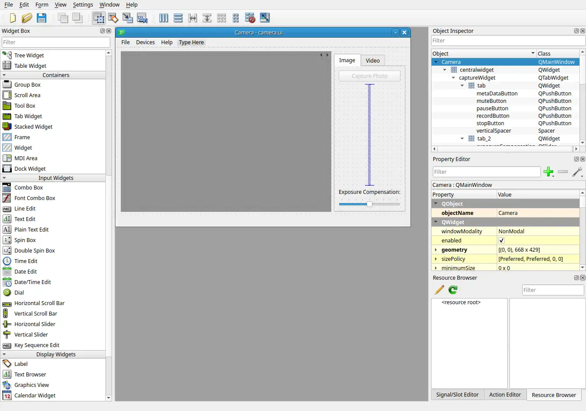
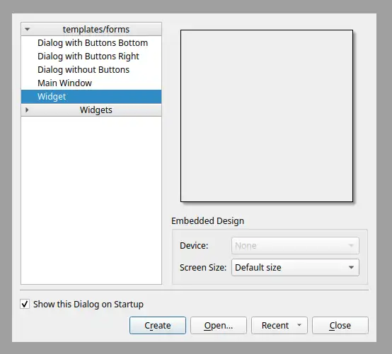
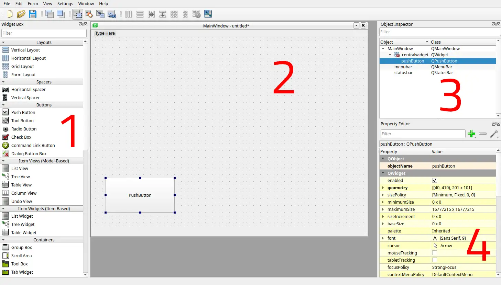
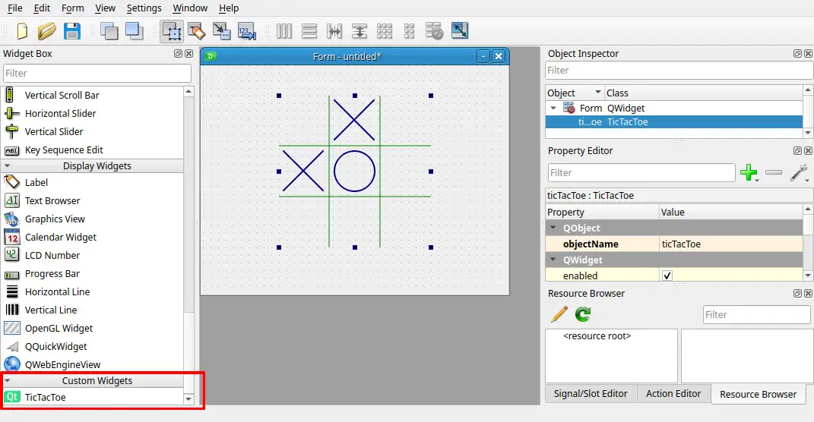

.. _pyside6-designer:

pyside6-designer
================

``pyside6-designer`` is a tool that wraps the `Qt Widgets Designer`_,
to enable you to design Qt Widgets applications with a *drag-and-drop*
approach.

Usage
-----

With ``pyside6-designer`` you can design your application in a simple way,
to later save the end result in a ``.ui`` file. When you start the tool, you
will see a dialog to select the base window: a QWidget, a QMainWindow, etc.

Once you select one of those options, you can start placing widgets
into the interface, and have access to the whole structure, properties,
and more.

A simple distinction of the areas you might use is described in the
previous screenshot. In the section **1** you will find all the elements
you can use in your application, which is the area **2**.
The application designs follows a hierarchical configuration,
in **3** you can see the structure of the example which contains
only a ``QMainWindow`` and a ``QPushButton``. Lastly
you can access and modify the properties of the item in **4**,
where you could adjust dimensions, names, etc.

When your application is finished, you will save your design in a ``.ui``
file. This ``.ui`` file can later be converted into a Python file,
with the help of the :ref:`pyside6-uic` tool. You can find
more details of this process in: :ref:`using_ui_files`.

If you are interested in more functionality of the tool, you can check
the official `Qt Widgets Designer Manual`_.

Custom Widgets
--------------

One of the features that the `Qt Widgets Designer`_ provides is the possibility
of loading custom widgets, in order to facilitate the development with ad-hoc
widgets.

On the following screenshot, you can see a new component on the left column
that is already added on the main widget, a tic-tac-toe custom widget.

To achieve this, you need to register a custom widget by setting the environment
variable ``PYSIDE_DESIGNER_PLUGINS`` to the directory where your register file
is located. The registration file for the tic-tac-toe widget looks like this:

.. code-block:: Python

    from tictactoe import TicTacToe
    from tictactoeplugin import TicTacToePlugin

    from PySide6.QtDesigner import QPyDesignerCustomWidgetCollection

    if __name__ == '__main__':
        QPyDesignerCustomWidgetCollection.addCustomWidget(TicTacToePlugin())

As you can see in the previous code, ``TicTacToe`` is the custom widget,
imported from a different file, and the ``TicTacToePlugin`` is the interface
layer for `Qt Widgets Designer`_ to recognize it.
We provide a helper class, ``QPyDesignerCustomWidgetCollection``, to
simplify the registration process.

If you are interested in all the details of this specific case, you can
check the :ref:`task-menu-extension-example`.

.. _`Qt Widgets Designer`: https://doc.qt.io/qt-6/qtdesigner-manual.html
.. _`Qt Widgets Designer Manual`: https://doc.qt.io/qt-6/qtdesigner-manual.html
