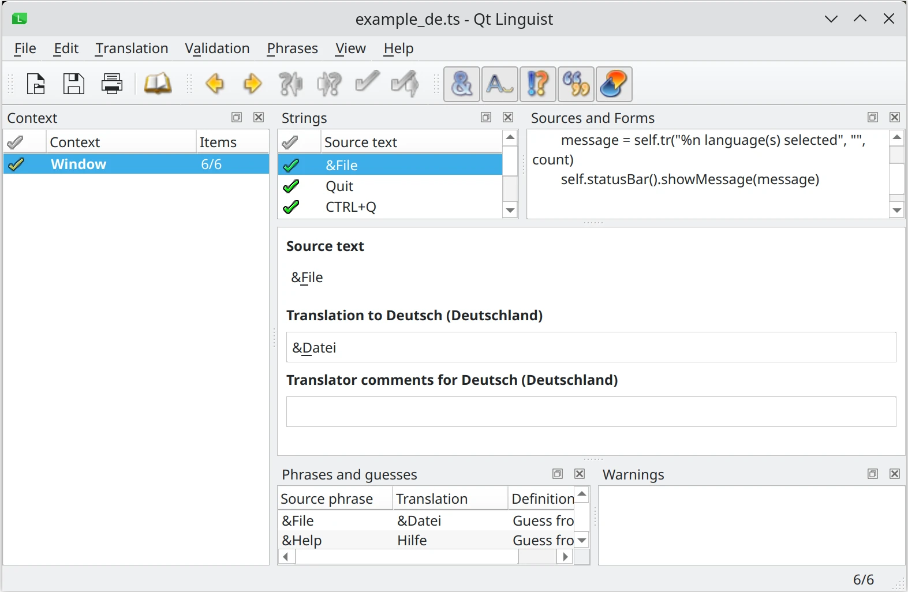

.. _pyside6-linguist:

pyside6-linguist
=================

``pyside6-linguist`` is a tool that wraps `Qt Linguist`_, Qt's tool to
translate user interfaces and manage application localizations. It
supports Qt's own TS file format as well as the XML Localization
Interchange File Format (XLIFF). There are no differences between the
version bundled with PySide and the one from Qt.

For more information on how to use this tool, read Qt's documentation
here: `Qt Linguist`_. Read more about how to translate PySide
applications here: :ref:`translations`.

.. _`Qt Linguist`: https://doc.qt.io/qt-6/qtlinguist-index.html
