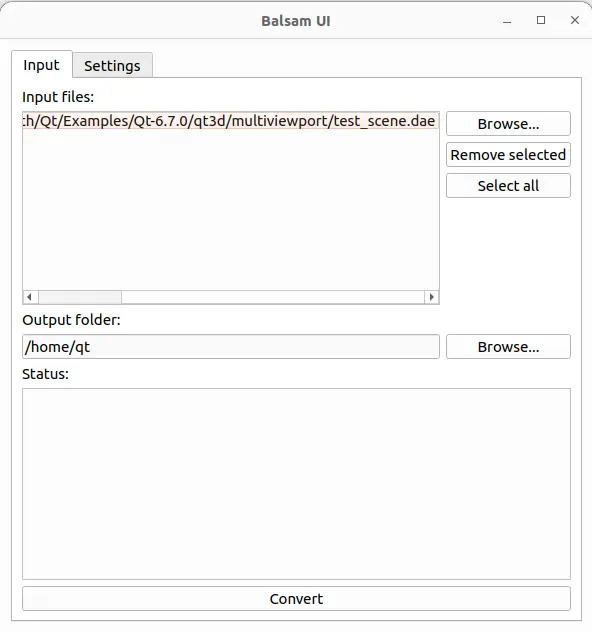

.. _pyside6-balsamui:

pyside6-balsamui
================

``pyside6-balsamui`` is graphical user interface frontend to the command line
tool :ref:`pyside6-balsam`. The purpose of the tool is to take assets created
in digital content creation tools like `Maya`_, `3ds Max`_ or `Blender`_ and
converts them into an efficient runtime format for use with Qt Quick 3D.

For more information on the further capabilities of the tool, read Qt's
documentation here: `Balsam Asset Import Tool`_.

.. _`Balsam Asset Import Tool`: https://doc.qt.io/qt-6/qtquick3d-tool-balsam.html
.. _Maya: https://www.autodesk.com/products/maya/overview
.. _3ds Max: https://www.autodesk.com/products/3ds-max/overview
.. _Blender: https://www.blender.org/

