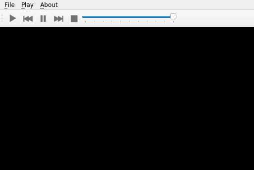
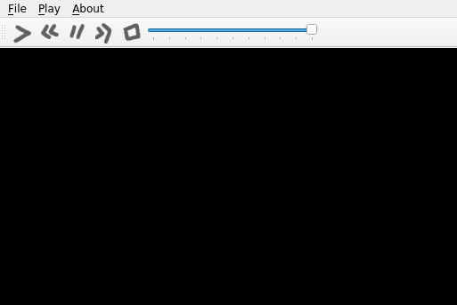

.. _using_qrc_files:

Using ``.qrc`` Files (``pyside6-rcc``)
**************************************

The `Qt Resource System`_ is a mechanism for storing binary files
in an application.

The files will be embedded into the application and be acessible for the
``QFile`` class and the constructors of the ``QIcon`` and ``QPixmap``
classes taking a file name by using a special file name starting with ``:/``.

The most common uses are for custom images, icons, fonts, among others.

In this tutorial you will learn how to load custom images as button icons.

For inspiration, we will try to adapt the multimedia player example
from Qt.

As you can see on the following image, the ``QPushButton`` that are used
for the media actions (play, pause, stop, and so on) are using the
default icons meant for such actions.

You could make the application more attractive by designing the icons,
but in case you don't want to design them, you can download and use them.

:download:`Download icons <icons.zip>`

You can find more information about the ``rcc`` command, and ``.qrc`` file
format, and the resource system in general in the `Qt Resource System`_
site.

The ``.qrc`` file
=================

Before running any command, add information about the resources to a ``.qrc``
file.
In the following example, notice how the resources are listed in ``icons.qrc``

::

    <!DOCTYPE RCC><RCC version="1.0">
    <qresource>
        <file>icons/play.png</file>
        <file>icons/pause.png</file>
        <file>icons/stop.png</file>
        <file>icons/previous.png</file>
        <file>icons/forward.png</file>
    </qresource>
    </RCC>

Generating a Python file
=========================

Now that the ``icons.qrc`` file is ready, use the ``pyside6-rcc`` tool to generate
a Python class containing the binary information about the resources

To do this, we need to run::

    pyside6-rcc icons.qrc -o rc_icons.py

The ``-o`` option lets you specify the output filename,
which is ``rc_icons.py`` in this case.

To use the generated file, add the following import at the top of your main Python file::

    import rc_icons

Changes in the code
===================

As you are modifying an existing example, you need to modify the
``player.py`` file. At the top, change

.. code-block:: python

    from PySide6.QtGui import QIcon, QKeySequence

to:

.. code-block:: python

    from PySide6.QtGui import QIcon, QKeySequence, QPixmap

Below the imports, add the following:

.. code-block:: python

    import rc_icons

In the ``MainWindow.__init__()`` function, replace the code
loading the icons from the theme by your custom icons:

.. code-block:: python

    playIcon = QIcon(QPixmap(":/icons/play.png"))
    self._play_action = tool_bar.addAction(playIcon, "Play")

When doing this for all icons, the constructor of your class should
look like this:

.. code-block:: python

    def __init__(self):
        super().__init__()

        self._playlist = []
        self._playlist_index = -1
        self._audio_output = QAudioOutput()
        self._player = QMediaPlayer()
        self._player.setAudioOutput(self._audio_output)

        self._player.errorOccurred.connect(self._player_error)

        tool_bar = QToolBar()
        self.addToolBar(tool_bar)

        file_menu = self.menuBar().addMenu("&File")
        icon = QIcon.fromTheme(QIcon.ThemeIcon.DocumentOpen)
        open_action = QAction(icon, "&Open...", self,
                              shortcut=QKeySequence.Open, triggered=self.open)
        file_menu.addAction(open_action)
        tool_bar.addAction(open_action)
        icon = QIcon.fromTheme(QIcon.ThemeIcon.ApplicationExit)
        exit_action = QAction(icon, "E&xit", self,
                              shortcut="Ctrl+Q", triggered=self.close)
        file_menu.addAction(exit_action)

        play_menu = self.menuBar().addMenu("&Play")
        playIcon = QIcon(QPixmap(":/icons/play.png"))
        self._play_action = tool_bar.addAction(playIcon, "Play")
        self._play_action.triggered.connect(self._player.play)
        play_menu.addAction(self._play_action)

        previousIcon = QIcon(QPixmap(":/icons/previous.png"))
        self._previous_action = tool_bar.addAction(previousIcon, "Previous")
        self._previous_action.triggered.connect(self.previous_clicked)
        play_menu.addAction(self._previous_action)

        pauseIcon = QIcon(QPixmap(":/icons/pause.png"))
        self._pause_action = tool_bar.addAction(pauseIcon, "Pause")
        self._pause_action.triggered.connect(self._player.pause)
        play_menu.addAction(self._pause_action)

        nextIcon = QIcon(QPixmap(":/icons/forward.png"))
        self._next_action = tool_bar.addAction(nextIcon, "Next")
        self._next_action.triggered.connect(self.next_clicked)
        play_menu.addAction(self._next_action)

        stopIcon = QIcon(QPixmap(":/icons/stop.png"))
        self._stop_action = tool_bar.addAction(stopIcon, "Stop")
        self._stop_action.triggered.connect(self._ensure_stopped)
        play_menu.addAction(self._stop_action)

        # many lines were omitted

Executing the example
=====================

Run the application by calling ``python main.py`` to checkout the new icon-set:

.. _`Qt Resource System`: https://doc.qt.io/qt-5/resources.html
