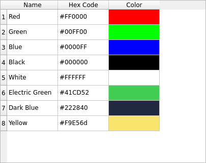

Displaying Data Using a Table Widget
====================================

If you want to display data arranged in a table, use a ``QTableWidget`` to do
so, without dealing with much configuration.

Notice that using a ``QTableWidget`` is not the only path to display
information in tables. You can also create a data model and display it using
a ``QTableView``, but that is not in the scope of this tutorial.

.. note:: This Widget is a ready-to-use version of something you can customize
   further on. To know more about the Model/View architecture in Qt, refer to
   its `official documentation <https://doc.qt.io/qt-6/model-view-programming.html>`_.

1. Import ``QTableWidget``, ``QTableWidgetItem``, and ``QColor`` to display
   background colors:

   .. code-block:: python

       import sys
       from PySide6.QtGui import QColor
       from PySide6.QtWidgets import (QApplication, QTableWidget,
                                      QTableWidgetItem)

2. Create a simple data model containing the list of names and hex codes for
   different colors:

   .. code-block:: python

       colors = [("Red", "#FF0000"),
                 ("Green", "#00FF00"),
                 ("Blue", "#0000FF"),
                 ("Black", "#000000"),
                 ("White", "#FFFFFF"),
                 ("Electric Green", "#41CD52"),
                 ("Dark Blue", "#222840"),
                 ("Yellow", "#F9E56d")]

3. Define a function to translate the hex code into an RGB equivalent:

   .. code-block:: python

       def get_rgb_from_hex(code):
           code_hex = code.replace("#", "")
           rgb = tuple(int(code_hex[i:i+2], 16) for i in (0, 2, 4))
           return QColor.fromRgb(rgb[0], rgb[1], rgb[2])

4. Initialize the ``QApplication`` singleton:

   .. code-block:: python

       app = QApplication()

5. Configure the ``QTableWidget`` to have a number of rows equivalent
   to the amount of items from the ``colors`` structure, and a number of
   columns with the members of one color entry, plus one.
   You can set the column name using the ``setHorizontalHeaderLabels`` as
   described below:

   .. code-block:: python

       table = QTableWidget()
       table.setRowCount(len(colors))
       table.setColumnCount(len(colors[0]) + 1)
       table.setHorizontalHeaderLabels(["Name", "Hex Code", "Color"])

   .. note:: the reason of using ``+ 1`` is to include a new column where
      we can display the color.

6. Iterate the data structure, create the ``QTableWidgetItems`` instances, and
   add them into the table using a ``x, y`` coordinate. Here the data is being
   assigned row-per-row:

   .. code-block:: python

       for i, (name, code) in enumerate(colors):
           item_name = QTableWidgetItem(name)
           item_code = QTableWidgetItem(code)
           item_color = QTableWidgetItem()
           item_color.setBackground(get_rgb_from_hex(code))
           table.setItem(i, 0, item_name)
           table.setItem(i, 1, item_code)
           table.setItem(i, 2, item_color)

7. Show the table and execute the ``QApplication``.

   .. code-block:: python

       table.show()
       sys.exit(app.exec())

The final application will look like this:

