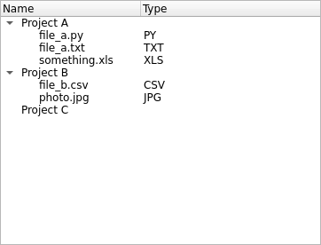

Displaying Data Using a Tree Widget
===================================

If you want to display data arranged in a tree, use a ``QTreeWidget`` to do so.

Notice that using a ``QTreeWidget`` is not the only path to display
information in trees. You can also create a data model and display it using a
``QTreeView``, but that is not in the scope of this tutorial.

.. note:: This Widget is a ready-to-use version of something you can customize
   further on. To know more about the Model/View architecture in Qt, refer to
   its `official documentation <https://doc.qt.io/qt-6/model-view-programming.html>`_.

1. Import ``QTreeWidget`` and ``QTreeWidgetItem`` for this application:

   .. code-block:: python

       import sys
       from PySide6.QtWidgets import QApplication, QTreeWidget, QTreeWidgetItem

2. Define a dictionary with project structures to display the information as a
   tree, with files belonging to each project:

   .. code-block:: python

       data = {"Project A": ["file_a.py", "file_a.txt", "something.xls"],
               "Project B": ["file_b.csv", "photo.jpg"],
               "Project C": []}

3. Initialize the ``QApplication`` singleton:

   .. code-block:: python

       app = QApplication()

4. Configure the ``QTreeWidget`` to have two columns, one for the item name,
   and the other for item type information of the files in the project
   directories.
   You can set the column name with the ``setHeaderLabels`` as described below:

   .. code-block:: python

       tree = QTreeWidget()
       tree.setColumnCount(2)
       tree.setHeaderLabels(["Name", "Type"])

5. Iterate the data structure, create the ``QTreeWidgetItem`` elements, and add
   the corresponding children to each parent.
   We also extract the extension name for only the files and add them
   into the second column.
   In the constructor, you can see that each element (``QTreeWidgetItem``) is
   added to different columns of the tree (``QTreeWidget``).

   .. code-block:: python

       items = []
       for key, values in data.items():
           item = QTreeWidgetItem([key])
           for value in values:
               ext = value.split(".")[-1].upper()
               child = QTreeWidgetItem([value, ext])
               item.addChild(child)
           items.append(item)

       tree.insertTopLevelItems(0, items)

7. Show the tree and execute the ``QApplication``.

   .. code-block:: python

       tree.show()
       sys.exit(app.exec_())

The final application will look like this:

