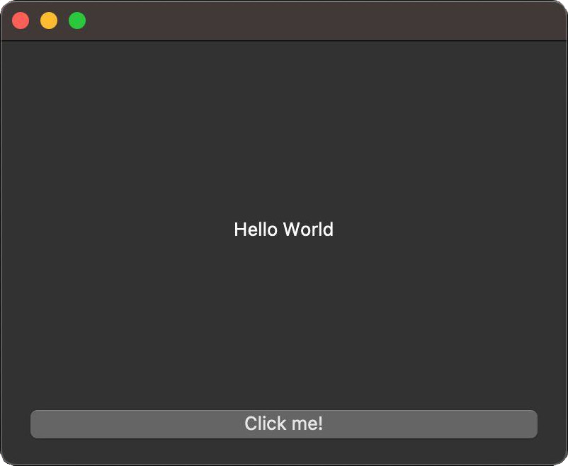
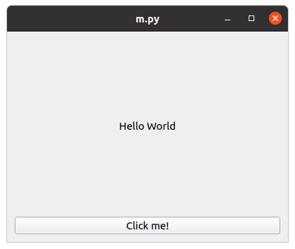

.. _whatisqt:

Qt, QML, Widgets...What Is The Difference?
==========================================

If you are new to Qt, there might be a chance that you are a bit confused about
all the concepts you have read so far. This section aims to provide a summary
of all the key components that are relevant to develop Qt applications.

Keep in mind that Qt was designed and written in C++ as a C++ framework, you
will find many references, examples, and concepts that make sense in C++
based applications, that might not be relevant in your Python applications,
but keep in mind that |project| aims to expose the Qt framework to Python
with many adaptations. You don't need to know C++ to use |project|, and you
can find all the possible combinations between these languages later on.

Qt
--

The Qt Project is an open collaboration that coordinates the development of the
Qt Framework. You might find situations where "Qt" refers to the project, or
to the framework.

As a framework, Qt has many components, which are distributed by components
and modules, for example, `qtbase <https://code.qt.io/cgit/qt/qtbase.git/>`_
is the base component that holds many modules, like: ``QtCore``, ``QtGui``,
``QtWidgets``, ``QtNetwork``, etc.
All those  modules contains many classes that you can directly use, like the
case of the `Classes of QtCore <https://doc.qt.io/qt-6/qtcore-module.html>`_
from which you can find classes like ``QFile``, ``QTime``, ``QByteArray``, etc.

You can create applications without a User Interface, while using this classes
to create command line applications, handle files, network connections,
regular expressions, encoding of text, etc.

On the other hand, you can create Graphical applications with classes
from the ``QtWidgets`` module, this is also referred as **Widgets**.

There are many other Qt modules like ``QtMultimedia``, ``QtCharts``, ``Qt3D``,
among others. These modules has a specific functionality, and among this
modules, there is one called ``QtDeclarative``, in which you can find the
implementation of the ``QML`` declarative language. This language is similar
to CSS and JSON, and it was created to design UI applications declaratively,
allowing JavaScript to take care of some imperative sections, and enabling
other components to extend and connect the code with C++.

Let us check the functionality of these different approaches separately.

Widgets
-------

As we mentioned before, ``QtWidgets`` is the module that provide predefined
Widgets that you can add into your graphical application, like Buttons, Labels,
Boxes, Menus, etc.

Widget based applications will look like a native application, because the goal
is not to affect the user experience compared to other included applications.

.. image:: hello_win10.jpg
    :width: 20%

.. note:: You can adapt these applications to use your self-made style, but
   you need to be aware that the goal of Widgets is to respect the system
   style, be careful when changing colors. Check this `simple tutorial
   <widgetstyling>`_ on how to do so.

QML
---

QML offers an alternative approach to create User Interfaces, compared to
Widgets, and it was originally motivated from mobile applications development.
Together with the ``Qt Quick`` module, it provides access to interact with
mobile device using actions like taps, drag and drop, animations, states,
transitions, drawer menus, etc.

The elements that you can find in QML/Quick applications are focused on
providing a more dynamic application infrastructure which different properties
based in certain behaviors.

Even though QML has the motivation to provide interfaces with mobile devices,
you can use it for Desktop applications, too.

Additionally, you can augment your application with standard JavaScript, which
in combination with C++ can become an attractive infrastructure.

Python And C++
--------------

For |project| applications you **do not need to know C++**, but it is possible
to mix both languages in a couple of different use cases:

1. If you have a Qt/C++ application, you can re-write it so it is a Qt/Python
   application. This means that Python aims to be a full replacement for the
   user level C++ code of Qt applications.
2. For custom Qt widgets written in C++, you can generate your own Python
   bindings so people can use it directly from Python.
3. If you have a C++ based library that you use with your Qt/C++ applications
   that is in charge of a specific task, like a performant process, you can
   generate bindings for it, so people could be able to use it from Python.
4. For a Qt/C++ application, you can extend it with Python, by exposing the
   main QApplication singleton as a python binding to a Python interpreter.
   This can be understand as a "Python Plugin System" for your Qt/C++
   application, for example.

For the the steps **2., 3., and 4.** you need the help of Shiboken, the
binding generation tool that is used to generate |project|.
You can find more information in the
`documentation page <https://doc.qt.io/qtforpython/shiboken6/index.html>`_.
