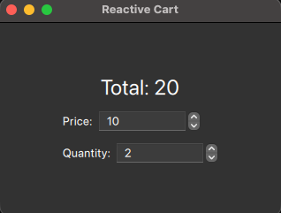

.. _tutorial_reactiveproperties:

Reactive Properties Tutorial
****************************

In this tutorial you will learn how to make a :class:`~PySide6.QtCore.QObject`
reactive and QML-bindable with very little code, using the decorators from the
:mod:`PySide6.QtQmlFeatures` module:
:func:`~PySide6.QtQmlFeatures.auto_properties`,
:func:`~PySide6.QtQmlFeatures.computed`,
:func:`~PySide6.QtQmlFeatures.watch`, and
:func:`~PySide6.QtQmlFeatures.effect`.

We start from a small shopping-cart class written the traditional way, with
:class:`~PySide6.QtCore.Property` and :class:`~PySide6.QtCore.Signal`, and then
rewrite it step by step, letting each decorator remove a chunk of boilerplate.

.. note:: The :mod:`PySide6.QtQmlFeatures` module is currently in technical
   preview.

The example
===========

The cart has two inputs and one derived value:

* ``price`` and ``quantity``: plain integer inputs.
* ``total``: always equal to ``price * quantity``.

On top of that we want two reactions whenever something changes:

* warn when the price jumps by more than 50% (we need the **old** and **new**
  values to decide), and
* log the cart's state after any change (we only need the **new** state).

These three needs map exactly onto the three decorators, as you will see:
``total`` becomes a :func:`~PySide6.QtQmlFeatures.computed`, the price jump
warning becomes a :func:`~PySide6.QtQmlFeatures.watch`, and the logging becomes
an :func:`~PySide6.QtQmlFeatures.effect`.

Step 1: The traditional approach
================================

Without the new decorators, every property is declared with the
:class:`~PySide6.QtCore.Property` decorator and needs a backing attribute, a
getter, a setter, and a notify :class:`~PySide6.QtCore.Signal`. The derived
``total`` has to be recomputed by hand, and the two reactions have to be called
explicitly from inside each setter.

.. literalinclude:: steps/01-manual.py
   :language: python
   :linenos:
   :lines: 5-

This works, but notice everything you had to write by hand:

* three :class:`~PySide6.QtCore.Signal` declarations,
* a backing field, a getter, and a setter for ``price`` and ``quantity``,
* a read-only ``total`` property plus a ``_recompute_total`` slot connected to
  both inputs,
* the old/new comparison for the price jump warning, inlined in the setter, and
* a ``_log_state`` call inlined in every setter.

The rest of the tutorial removes these one group at a time.

Step 2: Generate properties with ``@auto_properties`` and ``@computed``
=======================================================================

:func:`~PySide6.QtQmlFeatures.auto_properties` is a class decorator. It turns
every plain ``self.<name> = <value>`` assignment in ``__init__`` into a real
``Q_PROPERTY`` with a ``<name>Changed`` notify signal, and it turns every
:func:`~PySide6.QtQmlFeatures.computed` method into a cached, read-only
property.

.. literalinclude:: steps/02-auto-computed.py
   :language: python
   :linenos:
   :lines: 5-

The ``@computed("price", "quantity")`` decorator declares that ``total`` depends
on ``price`` and ``quantity``. The value is cached and recomputed only when one
of those dependencies changes; its ``totalChanged`` signal is emitted
automatically, so any QML binding reading ``total`` refreshes on its own. The
return annotation (``-> int``) lets ``@auto_properties`` infer the Qt type of
the property.

Compared to Step 1, the backing fields, getters, setters, the three explicit
``Signal`` objects, and the entire ``_recompute_total`` wiring are gone.

Step 3: React to changes with ``@watch``
========================================

A :func:`~PySide6.QtQmlFeatures.watch` method observes a single property. After
that property changes, the method is called with a
:class:`~PySide6.QtQmlFeatures.Change` describing what happened: it carries the
property ``name``, the ``old`` value, the ``new`` value, and the ``owner``.

.. literalinclude:: steps/03-watch.py
   :language: python
   :linenos:
   :lines: 5-

The price jump warning that lived inside the manual setter in Step 1 is now a
self-contained method. Because the :class:`~PySide6.QtQmlFeatures.Change` gives
us both ``change.old`` and ``change.new``, we can compare them directly. A
``@watch`` callback only runs when the value actually changes. Setting a
property to its current value does not trigger it.

.. note:: To watch more than one property, stack several ``@watch`` decorators
   on the same method, one per property.

Step 4: Run side effects with ``@effect``
=========================================

An :func:`~PySide6.QtQmlFeatures.effect` runs whenever **any** of the properties
it lists changes. Unlike ``@watch`` it receives no
:class:`~PySide6.QtQmlFeatures.Change`; it is simply called with ``self`` so it
can react to the new state.

.. literalinclude:: steps/04-effect.py
   :language: python
   :linenos:
   :lines: 5-

The ``_log_state`` calls that Step 1 had to sprinkle inside both setters are now
a single ``@effect("price", "quantity")`` method. Use ``@watch`` when you need
the before/after values and ``@effect`` when you only need to react to the new
state. See :ref:`watch-vs-effect` in the module reference for a side-by-side
comparison.

Run any of these steps directly to see the reactions on the console::

    $ python steps/04-effect.py
    initial total: 20
    warning: price jumped 10 -> 16
    cart: 16 x 2
    cart: 16 x 3
    final total: 48

Step 5: Bind it all from QML
============================

So far the cart has been driven from Python. The real payoff is that the
generated properties are ordinary ``Q_PROPERTY`` objects, so QML can both read
and write them, and the observers fire on changes written from QML too.

Add the ``@QmlElement`` decorator on top of
``@auto_properties`` and define the ``QML_IMPORT_NAME`` /
``QML_IMPORT_MAJOR_VERSION`` variables. Stack the decorators so
``@auto_properties`` runs first (innermost): it must add the generated
properties to the ``QMetaObject`` before ``@QmlElement`` registers the type.

.. literalinclude:: steps/05-app.py
   :language: python
   :linenos:
   :lines: 5-

The QML file reads ``total`` and writes ``price`` and ``quantity``:

.. literalinclude:: steps/cart.qml
   :language: javascript
   :linenos:
   :lines: 3-

When you drag a ``SpinBox``, QML writes ``cart.price`` (or ``cart.quantity``).
That runs the generated setter, which fires the ``@watch`` and ``@effect``
callbacks on the Python side, invalidates ``total``, and emits the notify
signal so the ``Total`` label re-evaluates, all without a single hand-written
signal connection.

Where to go next
================

For the full description of each decorator, the
:class:`~PySide6.QtQmlFeatures.Change` type, ``@auto_properties``, ``@computed``, ``@watch``, and
``@effect``, see the :mod:`PySide6.QtQmlFeatures` module reference.
